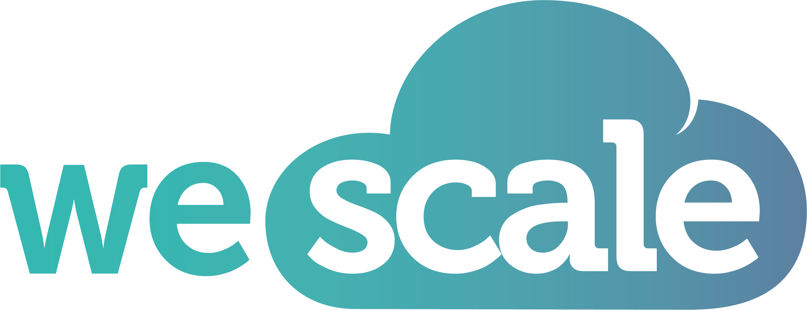

<!-- .slide: data-background-color="white" -->

Notes: Consultant Technique chez WeScale depuis début 2023

<!-- .slide: data-background-image="assets/wescale-cloud-advisor.png" data-background-size="contain" data-background-color="white" -->
Une ESN française de la Tech <!-- .element: class="stroke" -->
Notes:Une ESN française de la Tech, dont les missions sont principalement le
conseil sur les sujets de Cloud, d'orchestration de DevOps et de passage
à l'échelle

<!-- .slide: data-background-image="assets/wescale-nous-rejoindre.png" data-background-size="contain" data-background-color="white" -->
+ de 70 expert(e)s dans ces domaines <!-- .element: class="stroke" -->
Notes: Nous sommes + de 70 expert(e)s dans ces domaines, et nous cultivons
régulièrement notre expertise avec des contributions internes comme le Weshare
mensuel, qui est notre journée de partage, ou encore notre blog et notre
podcast, WeSpeakCloud, auquel je participe 😉

<!-- .slide: data-background-image="assets/wescale-nous-contacter.png" data-background-size="contain" data-background-color="white" -->
N'hésitez pas à nous contacter <!-- .element: class="stroke" -->
Notes: N'hésitez pas à nous contacter sur les résals socials si ça vous
intéresse, on se fera un plaisir de vous rediriger vers la personne appropriée
