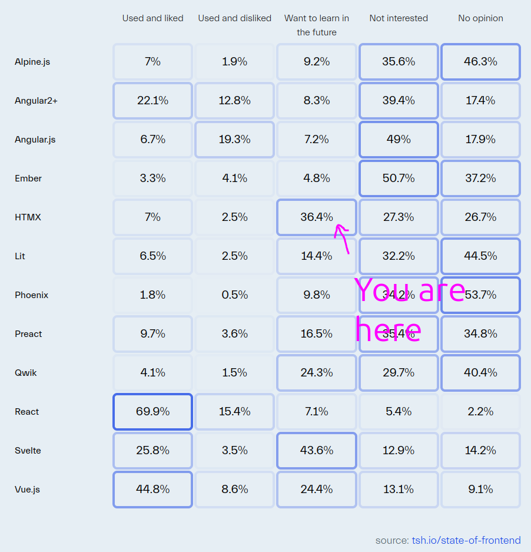
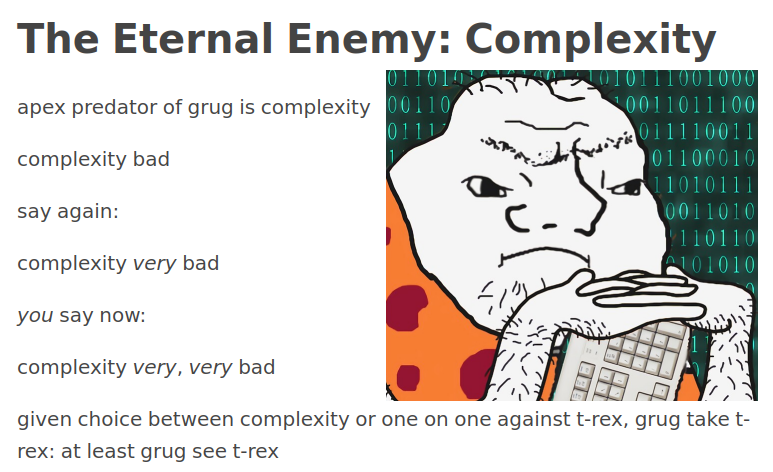
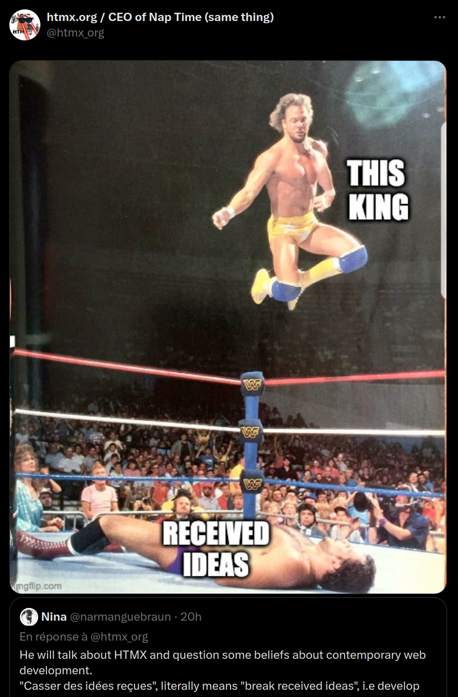

<!-- .slide: data-background-image="assets/title-card-bdx.png" -->
Notes: Bienvenue tout le monde !

Notes: Bravo, vous faites partie des 36 % !

Et je suis très intéressé par savoir un peu pourquoi vous vous intéressez à HTMX !

Notes: Moi, clairement, ce sont les memes qui m'ont d'abord attiré

Puis, c'est la réflexion de fond qui m'a retenu...

Notes: Et sachez que même cette conférence est dans son viseur !
(alors que je ne l'avais même pas pingé !)

On peut s'interroger de cette attitude, mais clairement ça a fonctionné, vu que vous êtes ici 😉
