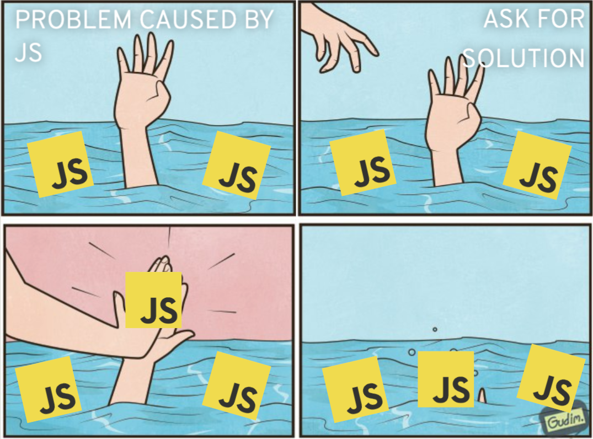
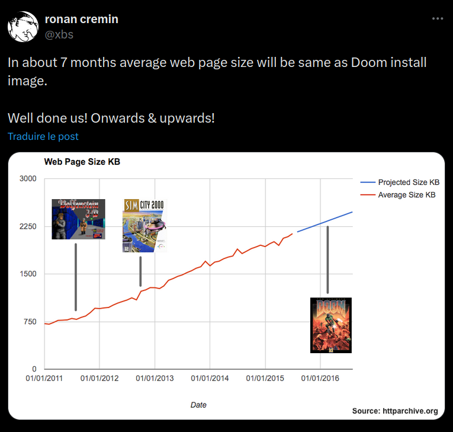
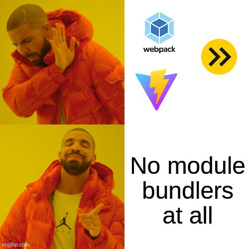
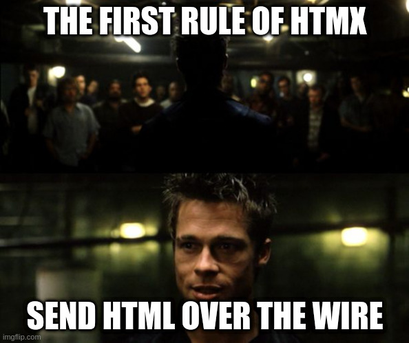
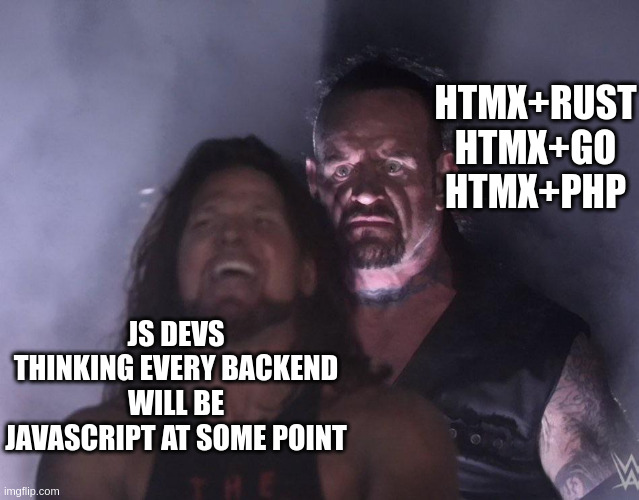
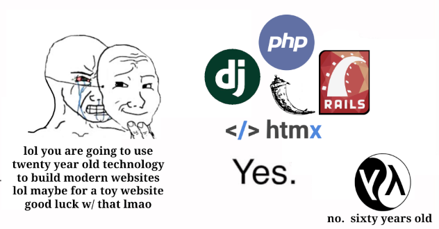
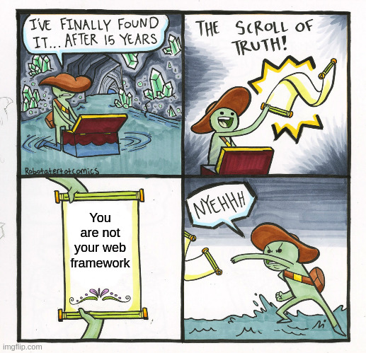

Notes: On va préfacer tout de suite: cette présentation est très "opiniated".
Elle se base sur ce que j'ai pu vivre au cours de ma désormais dizaine d'années
d'expérience dans le domaine, et de ce que j'ai pu lire et voir autour du
sujet. Ce n'est donc ni impartial ni objectif, mais je vais tenter d'être le
plus équitable possible (même si j'ai mon opinion, donc).


## Sommaire

- Un constat sur le dev Web "moderne"
- HTMX, un retour aux sources
- Alors, Révolution ou pas Révolution ?


## Les limites du «Toujours plus de JS !!!»


À la base, ça n'existe pas, une "application Web".
Notes: Web est avant tout une plateforme de distribution.

Le protocole HTTP est là pour récupérer des ressources qui vont elles-mêmes
aller récupérer d'autres ressources etc.
Le DOM du HTML, lui est là pour structurer l'information
Le CSS et le JS sont là pour rendre le tout un peu plus sympa à utiliser

Mais tout ça ne fait pas une application. Il y a du "routage" (historique, URLs),
il y a du "state" (cookies, localstorage), des API (caméra, micro, crypto),
mais rien pour ORCHESTRER tout ça, d'où l'importance de nos choix en tant que DEVS

Sauf que les devs ont eu tendance à tout voir sous le prisme du JS



Réinventer la roue en JS, constamment.
Notes: Comment simplement gérer un État applicatif front alors que la session
de l'utilisateur doit également être gérée côté Back (authentification,
d'autorisation, etc.).

Que se passe-t-il quand on fait F5 ? JS++

Que se passe-t-il s'il faut révoquer un accès ? JS++

Le SEO ? Problème auto-imposé, et donc JS++

Le SSR, l'hydration ? JS++

CSS ? Non, JS++


Au milieu ? De la soupe de JSON.
Notes: "View as a function of State" promulgué par React, bonne idée ! Mais
dans les faits c'est surtout "as a function of JSON"

Une industrie entière basée sur un format parce qu'on a voulu séparer les Fronteux des Backeux (OpenAPI, GraphQL, zod, et pareil côté Backend)

Perversion des principes du Web pour certaines raisons (cf chapitre dédié)


Notes: Oui je sais Linkedin c'est le mal.

Mais c'est partout maintenant. Ce n'est pas juste "le Back", c'est un ensemble.



Notes: Ça veut tout dire, non ?

On fait plus compliqué, alors qu'on devrait faire plus simple

Surtout sur du CRUD


Un autre monde est possible !
Notes: Un monde où les standards ne changent pas radicalement chaque année

Et sont même là depuis des dizaines d'années

Lindy Effect

Où les briques sont backward-compatibles

Où l'onboarding des nouveaux facilité

Le vendor lock-in limité à ce que vous y mettez


## Parlons donc d'HTMX
Notes: C'est quoi donc ?


C'est (juste) une librairie.


Notes: Juste une librairie, car le reste existe déjà

Dérivée d'Intercooler.js

Principe Unix: "Do one thing and do it well"

Mais dont le pitch est simple: vous avez déjà un framework pour faire du Web (HTTP, HTML, CSS et JS)


Basée sur HATEOAS et AJAX



(non ce ne sont pas des héros grecs)
Notes: Hypermedia As The Engine Of Application State

Asynchronous JavaScript and XML, le très mal nommé

HATEOAS: C'est l'Hypermedia (HTML) qui porte l'application.
HTML est structuré, accessible, compressible, découvrable, etc.
Les entêtes sont extrêmement important en HATEOAS (Redirections, Liens vers d'autres ressources, etc.)

On se repose donc lourdement sur HTTP

CSS décore, comme d'hab'

HTMX porte les interactions avec son JS

On ne fait donc du JS que pour des besoins très précis: Là un langage léger est pertinent !


```html
<button hx-post="/clicked" hx-swap="outerHTML">
  Click Me
</button>
```

> “Quand un utilisateur clique sur ce bouton, envoie une requête AJAX vers `/clicked`, et remplace le bouton par le HTML de la réponse.”
Notes: Simple, net, et sans bavure.

hx-post est un trigger, hx-swap défini le comportement au retour


```html
<table>
	<thead> ... </thead>
	<tbody id="result"> ... </tbody>
</table>
<form
  method="POST"
  hx-post="post-form"
  hx-target="#result"
  hx-swap="beforeend"
>
```

> “Quand un utilisateur soumet le formulaire, envoie une requête AJAX `POST` vers `/post-form`, et ajoute le HTML de la réponse juste avant la fin du tag ayant l'id `result`.”
Notes: Simple, net, et sans bavure.


```html
<tr hx-get="/contacts/?page=2"
    hx-trigger="revealed"
    hx-swap="afterend">
  <td>Agent Smith</td>
  <td>void29@null.org</td>
  <td>55F49448C0</td>
</tr>
```

> “Lorsque cette ligne est révélée dans le viewport, envoie une requête GET vers `/contacts/?page=2`, et ajoute le HTML de la réponse après cette ligne”


Oh vous voulez plus complexe ? Ok !


```html
<h2>Contacts</h2>
<table class="table">
  <thead>...</thead>
	<tbody id="contacts-table" hx-get="/contacts/table"
		hx-trigger="newContact from:body"> ... </tbody>
</table>
<h2>Add A Contact</h2>
<form hx-post="/contacts"> ... </form>
```

> “Lorsque le formulaire est soumis, envoie un POST vers `/contacts`. La réponse aura un `HX-Trigger` qui déclenchera un GET `/contacts/table`, qui rafraîchira la table”
Notes: Yep, c'est de la programmation évènementielle.

Sans observable, sans signaux, sans hooks.

Get rekt.


Résumé
- Front + Back sont l'«application» Web
- HTML d'abord
- CSS pour décorer
- JS *uniquement* quand c'est nécessaire

Notes: On s'impose ni SPA, ni MPA (ça peut même être hybride, osef).
On ne s'impose pas CSS non plus, si Tailwind vous convient go for it.

WYSIWYG, et c'est ça, finalement la révolution

Pas de minification ou d'obfuscation abusive, la compression et mise en cache se font avec HTTP

C'est trop simple pour être vrai, hein ?


HTMX est ce que le HTML aurait dû devenir avant qu'on bascule dans le «tout JavaScript»
Notes: Mais tout n'est pas perdu !


## Un ch'ti PoC



Front en HTML (incluant des WebComponents), du CSS, et...HTMX !


Juste du JS dans les WebComponents pour leur cycle de vie


Un backend en...Rust !
Notes: Alors c'est juste pour mon plaisir personnel

D'autres ont de très bons retours avec Go + Templ

L'important c'est la facilité de renvoyer du HTML

Pas besoin d'être une experte sur le sujet, vous allez vite vous y retrouver


C'est parti !


## En gros, c'est PHP/Django/RoR ?


Notes: PHP a également beaucoup évolué !
C'est de toute façon le moteur de 80% du Web (Wordpress)
Reste le poids de l'historique dans le langage, l'écosystème Apache, etc.

Citons notamment Symfony et Laravel côté frameworks

La philosophie est proche d'HTMX, en tout cas, comme quoi l'idée était déjà dans l'air du temps

Django et RoR sont des frameworks qui apportent de la productivité indéniables

Très utiles pour ceux que ça aide, en plus y a de l'intégration tierce (ORMs, Authentification, etc.)

Peuvent tout à fait s'utiliser avec HTMX en front !

Donc faut ouvrir ses chakras car…


Notes: Lindy Effect


## En conclusion ?

- Une critique assez forte du «Resume Driven Development»
- Revenons à la simplicité: traitons (et challegeons !) le Métier avant de se faire plaisir avec de la technique
- L'importance des abstractions: HTML, CSS, JS, à chaque couche son objectif


Vous n'êtes pas Dev X/Y/Z.


Vous êtes des Devs —tout court— <!-- .element: class="fragment" -->
Notes: Être un dev ne suffirait apparemment pas, il faut être un Dev "React", "Java", etc.

Et donc croître, croître, et justifier cette croissance.

Donc on en rajoute, là où on devrait plutôt enlever

et se concentrer sur les problèmes et les solutions qu'on peut apporter.

On n'est pas là pour pousser du JS à tout prix, seulement quand c'est nécessaire.


Car sinon on subit le principe du Marteau de Maslow:
> « If the only tool you have is a hammer, it is tempting to treat everything as if it were a nail. »


Retrouvez ce POC sur mon dépôt Github:


https://github.com/StephaneTrebel/poc-htmx-rust
