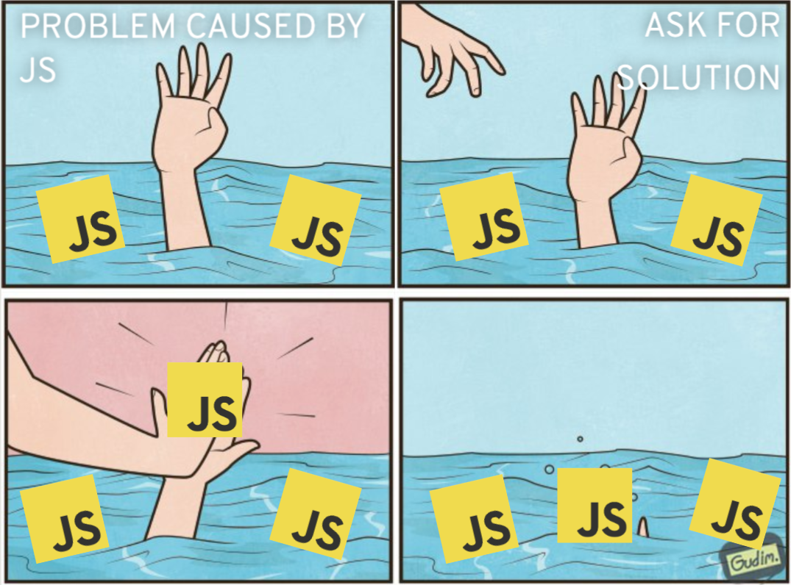

## Sommaire

- Un constat sur le dev Web "moderne"
- HTMX, un retour aux sources
- Alors, Révolution ou pas Révolution ?

Notes: On va préfacer tout de suite: cette présentation est très "opiniated".
Elle se base sur ce que j'ai pu vivre au cours de ma désormais dizaine d'années
d'expérience dans le domaine, et de ce que j'ai pu lire et voir autour du
sujet. Ce n'est donc ni impartial ni objectif, mais je vais tenter d'être le
plus équitable possible (même si j'ai mon opinion, donc).

AUTRE NOTE: Je compte bien donner cette conf à l'extérieur donc DES FEEDBACKS PLZ


## Les limites du «Toujours plus de JS !!!»


À la base, ça n'existe pas, une "application Web".
Notes: Web est avant tout une plateforme de distribution.

Le protocole HTTP est là pour récupérer des ressources qui vont elles-mêmes
aller récupérer d'autres ressources etc.
Le DOM du HTML, lui est là pour structurer l'information
Le CSS et le JS sont là pour rendre le tout un peu plus sympa à utiliser

Mais tout ça ne fait pas une application. Il y a du "routage" (historique, URLs),
il y a du "state" (cookies, localstorage), des API (caméra, micro, crypto),
mais rien pour ORCHESTRER tout ça.



Réinventer la roue, constamment.
Notes: Comment simplement gérer un État applicatif front alors que la session
de l'utilisateur doit également être gérée côté Back (authentification,
d'autorisation, etc.).

Que se passe-t-il quand on fait F5 ? JS++

Que se passe-t-il s'il faut révoquer un accès ? JS++

Le SEO ? Problème auto-imposé, et donc JS++

Le SSR, l'hydration ? JS++

CSS ? Non, JS++


De la soupe de JSON.
Notes: "View as a function of State" promulgué par React, bonne idée ! Mais
dans les faits c'est surtout "as a function of JSON"

Une industrie entière basée sur un format parce qu'on a voulu séparer les Fronteux des Backeux (OpenAPI, GraphQL, zod, et pareil côté Backend)

Perversion des principes du Web pour certaines raisons (cf chapitre dédié)


Javascript fatigue...
Notes: Maintenir tout ça

Passer sur la nouvelle version du framework, des dépendances

Gérer les vulnérabilités, faire de la veille, appréhender la suite

Passer sur un nouveau framework...pour quel ROI ? Pour le fun ? Le CV ?

Réinventer la roue c'est cher: on prend celle des voisins (left-pad, isEven, etc.)

Rocher de Sisyphe, quoi.


Notes: Oui je sais Linkedin c'est le mal.

Mais c'est partout maintenant. Ce n'est pas juste "le Back", c'est un ensemble.


Notes: Ça veut tout dire, non ?

On fait plus compliqué, alors qu'on devrait faire plus simple

Surtout sur du CRUD


Un autre monde est possible !
Notes: Un monde où les standards ne changent pas radicalement chaque année

Et sont même là depuis des dizaines d'années

Lindy Effect

Où les briques sont backward-compatibles

Où l'onboarding des nouveaux facilité

Le vendor lock-in limité à ce que vous y mettez


## Parlons donc d'HTMX
Notes: C'est quoi donc ?


Une librairie.


Notes: Juste une librairie, car le reste existe déjà

Dérivée d'Intercooler.js

Principe Unix: "Do one thing and do it well"

Mais dont le pitch est simple: vous avez déjà un framework pour faire du Web (HTTP, HTML, CSS et JS)


HATEOAS et AJAX


(non ce ne sont pas des héros grecs)
Notes: Hypermedia As The Engine Of Application State

Asynchronous Javascript and XML, le très mal nommé

HATEOAS: C'est l'Hypermedia (HTML) qui porte l'application.
HTML est structuré, accessible, compressible, découvrable, etc.
Les entêtes sont extrêmement important en HATEOAS (Redirections, Liens vers d'autres ressources, etc.)

On se repose donc lourdement sur HTTP

CSS décore, comme d'hab'

HTMX porte les interactions avec son JS

On ne fait donc du JS que pour des besoins très précis: Là un langage léger est pertinent !


```html
<button hx-post="/clicked" hx-swap="outerHTML">
  Click Me
</button>
```

> “Quand un utilisateur clique sur ce bouton, envoie une requête AJAX vers `/clicked`, et remplace le bouton par le HTML de la réponse.”
Notes: Simple, net, et sans bavure.

hx-post est un trigger, hx-swap défini le comportement au retour


```html
<table>
	<thead> ... </thead>
	<tbody id="result"> ... </tbody>
</table>
<form
  method="POST"
  hx-post="post-form"
  hx-target="#result"
  hx-swap="beforeend"
>
```

> “Quand un utilisateur soumet le formulaire, envoie une requête AJAX `POST` vers `/post-form`, et ajoute le HTML de la réponse juste avant la fin du tag ayant l'id `result`.”
Notes: Simple, net, et sans bavure.


```html
<tr hx-get="/contacts/?page=2"
    hx-trigger="revealed"
    hx-swap="afterend">
  <td>Agent Smith</td>
  <td>void29@null.org</td>
  <td>55F49448C0</td>
</tr>
```

> “Lorsque cette ligne est révélée dans le viewport, envoie une requête GET vers `/contacts/?page=2`, et ajoute le HTML de la réponse après cette ligne”


Oh vous voulez plus complexe ? Ok !


```html
<h2>Contacts</h2>
<table class="table">
  <thead>...</thead>
	<tbody id="contacts-table" hx-get="/contacts/table"
		hx-trigger="newContact from:body"> ... </tbody>
</table>
<h2>Add A Contact</h2>
<form hx-post="/contacts"> ... </form>
```

> “Lorsqu'on soumet le formulaire, envoie une requête POST vers `/contacts`. La réponse aura un en-tête `HX-Trigger:newContact` qui déclenchera une requête GET vers `/contacts/table`, ce qui rafraîchira la table.
Notes: Yep, c'est de la programmation évènementielle.

Sans observable, sans signaux, sans hooks.

Get rekt.


Résumé
- Front + Back sont l'«application» Web
- HTML d'abord
- CSS pour décorer
- JS *uniquement* quand c'est nécessaire

C'est tout. <!-- .element: class="fragment" -->

Le reste, c'est votre boulot. <!-- .element: class="fragment" -->
Notes: On s'impose ni SPA, ni MPA (ça peut même être hybride, osef)

WYSIWYG, et c'est ça, finalement la révolution

Pas de minification ou d'obfuscation abusive, la compression et mise en cache se font avec HTTP

C'est trop simple pour être vrai, hein ?


HTMX est ce que le HTML aurait dû devenir avant qu'on bascule dans le «tout Javascript»
Notes: Mais tout n'est pas perdu !


## Pourquoi HTMX en 2024 ?


Parce que les WebComponents sont (enfin) matures
Notes: Énormément de chemin parcouru

La moitié de la proposition de valeur des frameworks web part en fumée

Encore des choses à voir (Shadow DOM) mais ça progresse


Parce que CSS a beaucoup évolué
Notes: et s'embarque très bien dans les WebComponents

Variables, règles, display, etc.

Mais vous pouvez coller du Tailwind si vous vous voulez, hein !
Sauf que là on est dans un esprit plutôt #NoBuild

Ou, du moins, #OnlyAddWhenNecessary


Parce que Javascript a également évolué
Notes: Les classes ont permis l'émergence des WebComponents

Les futures évolutions (private fields) permettront davantage d'isolation

Reste le problème du typage mais Typescript ou JsDocs font le taf

Cela dit, j'insiste #OnlyAddWhenNecessary


## Un ch'ti PoC


Front en HTML (incluant des WebComponents), du CSS, et...HTMX !


Juste du JS dans les WebComponents pour leur cycle de vie


Un backend en...Rust !
Notes: Alors c'est juste pour mon plaisir personnel

D'autres ont de très bons retours avec Go + Templ

L'important c'est la facilité de renvoyer du HTML

Pas besoin d'être une experte sur le sujet, vous allez vite vous y retrouver


C'est parti !


## En gros, c'est PHP/Django/RoR ?


Notes: PHP a également beaucoup évolué !
C'est de toute façon le moteur de 80% du Web (Wordpress)
Reste le poids de l'historique dans le langage, l'écosystème Apache, etc.

Citons notamment Symfony et Laravel côté frameworks

La philosophie est proche d'HTMX, en tout cas, comme quoi l'idée était déjà dans l'air du temps

Django et RoR sont des frameworks qui apportent de la productivité indéniables

Très utiles pour ceux que ça aide, en plus y a de l'intégration tierce (ORMs, Authentification, etc.)

Peuvent tout à fait s'utiliser avec HTMX en front !

Donc faut ouvrir ses chakras car…


Notes: Lindy Effect


## Ne plus penser en Front/Back mais en Front+Back


Vous êtes des devs, vous apportez une solution
Notes: Vous n'êtes pas juste là pour "clore du ticket JIRA"


L'approche Produit est forcément globale
Notes: Des fois il y aura un peu de Front, d'autre fois beaucoup

Pareil côté Back


« Front+Back y a trop de choses à savoir ! »
Notes: Spoiler alert -> Non.

S'il y a trop c'est qu'il y a beaucoup à dégager, justement.

Revenir à quelque chose de simple, fonctionnel, "MVP"


> “Il ne faut toucher à l'architecture que d'une main tremblante.”
>
> *Montesquieu contemporain*


## Le «XY problem» qui nous a conduit à vouloir tout résoudre avec du JS
Notes:
Définir le XY problem


HTML et CSS ont évolué mais pas assez vite pour le "Web 2.0"
Notes: Web au début des années "10" (Internet Explorer, Google Chrome, Iphone, No React, Angular.js débute)

Beaucoup de monde déployait encore en prod avec un simple SSH.

Plateforme de distribution de documents -> On veut distribution d'Applications

Sauf que le Web n'est pas fait pour les applications (par de libQt, VisualStudio, etc.)

HTML , CSS , et le Javascript qui est capable, avec du code exécutable, d'interagir avec le DOM.

Problématiques: composants réutilisables (WebComponents n'existent pas encore), scoping CSS (et sa non-programmatisation)

Reste un truc intéressant pour le dev applicatif: Javascript


Javascript est un langage très facile à apprendre (mais très difficile à maîtriser)

Notes: Simple à apprendre, nativement supporté dans les navigateurs, et sa légèreté versus les environnements de développement propriétaires (moi je viens de ERP).

En revanche on a clairement sous-estimé son plafond (prototypes, callbacks anyone ?)

Et bam, le ver était dans le fruit: Puisqu'on peut modifier le DOM avec le Javacript, on VA modifier le DOM avec le Javascript.

Routage qui nous fait perdre le fil de notre javascript ? SPA !

Faire des allers-retours avec les backends ? État local !

Le mobile et les progressive web apps émergent, et tout ça demande beaucoup de Javascript ! Ça par contre, ça a été assez vite douché, pour le meilleur et pour le pire, côté Mobile.


Le "problème" Node.js
Notes: Domestiqué le Front avec le Javascript -> Maintenant le Back

Node.js est une pure merveille de technologie: V8 côté serveur ! Event Loop ! Branchements C++ !

Mais attention au principe du Marteau.

Node.js s'aborde simplement mais il y a un plafond de skill très haut (Buffers, Streaming, etc.)

Combiné à la souplesse permissive de Javascript…aïe aïe aïe !

Compétences Front ne sont pas équivalentes en Back (BDD, réseau, sécurité, etc.).

Javascript en Front, en Back, et au milieu ? De la Soupe de JSON.

Et les fossoyeurs de nous vendre les pelles (Bundling, API Management, GraphQL, Typescript, etc.).


## la siloisation des équipes et leur ultra-spécialisation


Plus de devs c'est bien, ne pas les former c'est mal
Notes: Tout le monde exposé au Web à partir de 2010

Attraction énorme, visibilité du code grâce à l'OpenSource

Bootcamps, filières de reconversion, crise économique de 2008-2010

Mais pas vraiment d'encadrement technique, et encore moins d'excellence

Javascript est simple à apprendre, HTML et CSS beaucoup moins -> Faisons du JS !

Et donc JS Front et Back, et donc du Node.js, et en passant aux orties la qualité


La responsabilité collective
Notes: Gros engouement autour de Javascript nourrit les flammes de l'ambition

Les entreprises veulent se rajeunir avec de l'Angular, React, etc.

Syndrome de la Silicon Valley

Transition des applis lourdes vers le Web faites au forceps


Un situation contemporaine ubuesque
Notes: Des frameworks qui DOIVENT s'adapter pour survivre ("nouveaux paradigmes")

Marketing à donf'

Les nouveautés corrigent des problèmes, et créent leur lot de nouveau problèmes, etc.

Les stacks se complexifient car on se segmente, et donc on doit justifier cette segmentation


## En conclusion ?

- Une critique assez forte du «Resume Driven Development»
- Revenons à la simplicité: traitons du métier avant de se faire plaisir avec de la technique
- L'importance des abstractions: HTML, CSS, JS, à chaque couche son objectif


Vous n'êtes pas Dev X/Y/Z.


Vous êtes un Dev —tout court— <!-- .element: class="fragment" -->
Notes: Être un dev ne suffirait apparemment pas, il faut être un Dev "React", "Java", etc.

Et donc croître, croître, et justifier cette croissance.

Donc on en rajoute, là où on devrait plutôt enlever

et se concentrer sur les problèmes et les solutions qu'on peut apporter.

On n'est pas là pour pousser du JS à tout prix, seulement quand c'est nécessaire.
