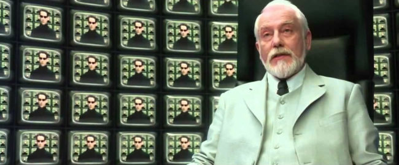

Mais «qu'est-ce que les Méta-lois ?», vous demandez-vous ?

Hmm...Revenons à notre protagoniste, Laurie

Notes:Laurie débarque fraîchement dans sa nouvelle boîte Metacortex. Un fleuron de l'industrie du numérique qui recrute dès la sortie d'école pour offrir un avenir radieux dans le développement logiciel !

Notes: Et son manager la colle sur un projet en tant que "Développeuse Front sur la page Panier du site d'Ecommerce d'une grande marque". Elle aura en charge de contribuer à développer les fonctionnalités de cette page avec son équipe, et elle dépendra intégralement des autres équipes, que ce soit du Back pour récupérer les données du panier, ou encore des autres équipes Front pour récupérer les informations utilisateur.

Laurie s'intérroge. Elle est developpeuse Web, elle pourrait tout à fait s'occuper du Front, et du Back. D'ailleurs elle a été formée à pouvoir traiter de toutes les couches, de la Conception à l'infrastructure, en passant bien sûr par le Front et le Back

Notes: Et là son manager lui dit:
"Non nous on ne fait que du Front, et encore sur la page Panier. Écoute, tu viens d'arriver, tu es jeune, tu ne sais pas comment ça se passe dans le monde des adultes. Ici chez Metacortex on est très très sérieux et on utilise des méthodes de pointe comme SCRUM, etc. Toi tu t'adaptes. T'es ici pour faire du Front, et uniquement du Front."

Laurie vient de découvrir…

### La Loi de Conway

> Toute organisation qui conçoit un système produira un système dont la structure est une copie de la structure de communication de l'organisation

Ce que ça veut dire concrètement pour vous, comme pour Laurie :
<ul role="list" class="custom-list-types">
  <li data-icon="🛑">Votre architecture est déjà décidée d'avance: Vos interfaces sont les équipes de l'entreprise.</li>
  <li data-icon="🙅">Si vous allez à l'encontre de cette Loi, vous allez avoir des soucis</li>
  <li data-icon="🥲">C'est de loin la plus connue et pour une bonne raison: Elle. est. OMNIPRÉSENTE.</li>
</ul>
Notes: Comme souci on peut tout simplement évoquer «Qui va être responsable de la fonctionnalité transverse: l'équipe A ou l'équipe B ?».

On peut également parler des groupes (pour celles et ceux qui font du RBAC) et le problème d'attribution des gens à plusieurs groupes, et bien sûr la friction de gérer ça dans le temps.

Comment mitiger la Loi de Conway ?
<ul role="list" class="custom-list-types">
  <li data-icon="🙈">« That's the neat thing: You don't. »</li>
  <li data-icon="😫">Changer l'organisation _permettrait_ de changer l'architecture, mais c'est dur</li>
  <li data-icon="🦄">Adopter des modèles d'organisation qui permettent de contourner le problème</li>
</ul>
Notes: Par exemple utiliser des stack techniques dites "FullStack"
Pour les RH, valoriser la pluridisciplinarité
Pour notre histoire de groupes d'accès, envisager les modèles Attributes based qui permettent de la Composition de droits et pas de l'héritage (L'héritage c'est mal tfaçon 😝)

Bon c'est pas tout ça, revenons à Laurie.

Notes: Notre Laurie s'attaque donc à la base de code de son équipe, d'ailleurs entièrement composée de juniors comme elle, et c'est un vrai plat de spaghetti ! Ardente et motivée elle commence à mettre de l'ordre là-dedans, pour vite se rendre compte que quoi qu'elle touche, une autre partie de la page se casse la figure...un vrai Mikado !

La pauvre, la voilà au prise avec…

### La Palissade de Chesterton

> Tout changement ne devrait être réalisé que lorsque la raison derrière l'état actuel a été comprise.
Notes: «Chesterton's Fence», car c'est basé sur expression de pensée autour d'une palissade, que quelqu'un envisage de détruire car il ne voit pas à quoi elle sert. Ce à quoi son compagnon non seulement lui interdit de la détruire, mais l'oblige à en déterminer la raison de l'existence de cette palissade AFIN de pouvoir comprendre pourquoi il faut la détruire.

Pas vraiment besoin de vous détailler le lien avec cette naïve Laurie, vous l'aurez compris: toucher à une base de code sans savoir vraiment pourquoi les choses sont comme elles sont vous exposera à la plus sévère des punitions: corriger un bug de Prod en urgence un Vendredi à 18h30 !

Et donc:
<ul role="list" class="custom-list-types">
  <li data-icon="🧓">Le « Legacy », ça n'existe pas. Il n'y a que des projets nouveaux et des projets anciens</li>
  <li data-icon="💰">Les projets anciens sont ceux qui paient les factures, traitons-les avec respect !</li>
  <li data-icon="😅">Le code est "moche" _parce que_ le métier est complexe. Simplifier impliquerait de simplifier le métier (bon courage !)</li>
</ul>

Comment mitiger la Palissade de Chesterton ?
<ul role="list" class="custom-list-types">
  <li data-icon="🤔">Prendre le temps *comprendre* le Domaine (pas réservé aux POs !)</li>
  <li data-icon="📝">Documenter les règles de gestion, d'où elles viennent et leur raison d'être</li>
  <li data-icon="💪">Écrire des tests E2E. Oui c'est cher, mais ce sont vos invariants au niveau le plus haut !</li>
</ul>
Notes: Pas grand-chose à ajouter à tout ça. Mais vous pouvez déjà noter que la Loi de Conway n'incite pas à ce genre de travaux. On a toujours des "équipes dédiées", d'ailleurs toujours surchargées, qui sont censées s'occuper de tout ça, mais bon, investir dans votre compréhension des choses devrait être une évidence 😉

Allez, on retourne voir comment va notre Laurie...

Notes: La voilà aux prises d'un individu peu recommandable, qui lui dit qu'elle a intérêt à bosser car la couverture de code est passée en-dessous des 80%, ce qui est contraire à la politique de l'entreprise.

Notes: Stressée par l'envie de bien faire, elle devient un peu prête à tout, quitte à écrire des tests unitaires juste pour faire remonter le taux de couverture de code au-dessus des 80%, et ainsi éviter les foudres de Sonarqube

Pas de bol pour Laurie, elle est tombée en plein dans...

### La cruelle Loi de Goodhart

> Lorsqu'une mesure devient une cible, elle cesse d'être une bonne mesure.
Notes: Les humains sont prédictibles: iels cherchent la voie du moindre effort surtout en situation de stress.

Si vous leur mettez la pression à un sujet, leur énergie sera dépensée non pour atteindre les objectifs,
mais pour pervertir le thermomètre à moindre effort.

Comment mitiger cette stratégie de dévitalisation systématique ?
<ul role="list" class="custom-list-types">
  <li data-icon="🤨">Arrêter le "Un problème est survenu; vite, un KPI !"</li>
  <li data-icon="🦾">Délimitez un ensemble <em>limité</em> de SLO/SLA/SLI attribuables à <em>l'Équipe</em> sur un périmètre qu'elle <em>maîtrise</em></li>
  <li data-icon="🫂">Suivre avec <strong>bienveillance</strong>. Un SLI mauvais est simplement une opportunité de s'améliorer</li>
</ul>
Notes: SLO/A/I: Service Level Objective/Agreement/Indicators

Bon, comment elle va, Laurie ?

Notes: Elle en marre de se faire marcher dessus, elle s'est (bon ici, un peu trop littéralement) armée de son expérience pour affronter les métas-lois. Elle est sûre d'elle, très sûre d'elle...trop sûre d'elle ?

### L'effet Dunning-Kruger

> Les personnes ayant une compétence limitée dans un domaine surestiment souvent leurs capacités.

Corrolaire:
> Les gens performants ont tendance à sous-estimer leurs compétences dans un domaine d'expertise

Reconnaître qu'il y a trois types d'informations:
<ul role="list" class="custom-list-types">
  <li data-icon="😌">Ce qu'on sait</li>
  <li data-icon="😨">Ce qu'on sait qu'on ne sait pas</li>
  <li data-icon="🤯">Ce qu'on ne sait pas qu'on ne sait pas</li>
</ul>
Notes: Si vous pensez ne pas être affecté par l'effet Dunning-Kruger, vous êtes très probablement affecté par l'effet Dunning-Kruger :)

Alors celui-là est assez controversé car il a été souvent mal compris, notamment dans le cadre de l'étude de la porosité des gens à la désinformation. Il y a d'ailleurs apparemment des différences culturelles qui tempéreraient tout ça. Il reste que c'est quand même assez logique dans les grandes lignes à cause du fameux "Ce qu'on sait pas qu'on ne sait pas", cher à Donald Rumsfeld. C'est le fait de ne pas prêter attention à ça qui vous fait facilement basculer dans une surconfiance hasardeuse

Pour mitiger, rien de plus simple:
<ul role="list" class="custom-list-types">
  <li data-icon="👂">Identifier et écouter ces "High Performers", qui ne sont pas celleux qui se vendent le mieux, loin de là !</li>
  <li data-icon="🏃">Se remettre en question continuellement</li>
  <li data-icon="🧘">Attention au syndrome de l'imposteur: tenter et échouer, c'est aussi apprendre</li>
</ul>

Avec ça, Laurie peut repartir sur de bonnes bases 😌

Notes: Sauf qu'en rétrospective elle se fait un peu gentiment allumer par l'Architecte, car avec tout ça elle est à la bourre et c'est pas ce qu'il avait prévu dans son joli powerpoint. Et il s'est engagé auprès du client sur le fait que la page Panier serait capable de montrer des vidéos en 4K des produits réservés, donc ça va pas dut tout, ça !

Aïe, oui, ça a pris plus de temps que prévu, car deux sœurs jumelles ourdissaient déjà dans le dos de Laurie...

Qui ? Je veux bien sûr parler de...

### Loi de Hofstadter:
> Ça prendra toujours plus de temps que vous le pensez, même en prenant en compte la loi de Hofstadter.

### Loi de Parkinson:
> Quel que soit le travail à faire, la durée d'une tâche s'étirera pour remplir le temps qui lui est alloué.
Notes: Ou pourquoi les estimations c'est de la daube 🙄

Les humains sont *catastrophiquement* mauvais dans leurs estimations.

Ben kékonfait alors ?
<ul role="list" class="custom-list-types">
  <li data-icon="👂">Ne pas estimer ? Tentant ! Mais difficile à vendre !</li>
  <li data-icon="🏋️‍♂️">Admettre que dans MVP, le "M" veut dire "Minimum": Itérez, itérez, itérez !</li>
  <li data-icon="🕵️‍♂️">Être transparent et sincère. Anticiper les zones de faible maîtrise (technique ou fonctionnel)</li>
</ul>

On en revient à la <strong>bienveillance</strong>.
Notes: L'impredictibilité est un révélateur des inconnues inconnues (cf Dunning-Kruger, qui affecte donc les organisations autant que les humains).
- Limiter le Domaine métier limite la complexité attendue (cf Chesterton)
- La formation est également un facteur clé: Si vous ne savez rien faire correctement, comment savoir combien de temps vous prendra n'importe quoi ?
- Utiliser des «Boring Technologies» (cf L'Effet Lindy) permet de limiter la charge de maintenance purement technique

« Attends, il a dit quoi, là ? C'est quoi, ça, l'Effet Lindy ? »

Notes: Un collègue Senior, d'une antique équipe chargée de maintenir un logiciel de comptabilité en COBOL, entend la question et décide d'intervenir.

« Les technologies dites "ennuyeuses", ou "anciennes" sont de bonnes technologies, car elles ont passé l'épreuve du temps »

### L'effet Lindy

> Plus longtemps quelque chose de non-périssable existe ou est présentement utilisée, plus longtemps son espérance de vie s'allonge.
Notes: Je vous laisse vous chauffer le ravioli avec ça deux secondes 😁

<ul role="list" class="custom-list-types">
  <li data-icon="🗻">Ce qui dure a une raison de durer, et cette raison fait qu'il continuera à durer</li>
  <li data-icon="👶">À l'inverse, ce qui est nouveau n'a pas encore suffisamment subi les foudres du monde Réel</li>
  <li data-icon="🙏">La nouveauté doit redécouvrir ces principes…quitte à y laisser sa jeunesse !</li>
  <li data-icon="💡">Être moderne c'est simplement être contemporain, pas être "meilleur"</li>
</ul>
Notes:
- Le statu quo est cette fois votre allié: se concentrer sur la maintenabilité de ce qui est existe coûte beaucoup moins cher que de faire fonctionner le dernier truc à la mode qui vient de sortir et qui sera probablement has-been dans un an, ou cinq.
- Faire sa veille mais ne pas en faire sa boussole
- Bannir le « CV Driven Development ». Le monde ne tourne pas autour de votre CV. Les utilisateurs se contrefichent que ça aide votre carrière.

### L'implacable loi de Tesler

« An application inherent complexity can never be removed, nor hidden, only dealt with trade-offs. »

- Elle envoie au tapis toutes les promesses de simplification, mais on peut jouer avec. Un peu
- Là encore un constat d'impuissance qu'il faut accepter: les applications sont _complexes_
- La question est de savoir _comment_ on va traiter cette complexité
- Non on ne peut pas «tout bourrer côté client», «tout gérer par le backend», «tout faire en no-code» (lol)

Pour mitiger il va falloir donc faire quelque chose qu'on aime rarement faire:
- Accepter la complexité et la placer à l'endroit où elle sera le plus facilement gérable
- Refuser la complexité dans toutes les autres couches (et donc refuser le complexité pour la complexité)
- Nécessite un réel contrat entre le Métier et la Technique car (Chesterton oblige), c'est du Métier que vient la complexité
- Votre application n'est-elle finalement qu'un formulaire très complexe ? Un algorithme alambiqué ? Une interface d'API glorifiée ? Acceptez-le, et faites en fonction.

### La loi d'Hyrum, ou le Contrat Involontaire

« With a sufficient number of users of an API, it does not matter what you promise in the contract: all observable behaviors of your system will be depended on by somebody. »

- Plutôt applicable au code exposé publiquement, mais peut tout à fait arriver en code interne d'entreprise
- Incite à réfléchir à vos API *quelles qu'elles soient*. Si c'est "public" quelqu'un s'en servira

Par conséquent c'est assez facile à mitiger sur le papier:
- N'exposer que ce qui doit l'être. Le reste *DOIT* fonctionner en boîte noire
- Communiquer sur les changements (duh !)
- Accepter que toute mise à jour (oui, même un patch) peut être un Breaking Change.
- _Semver is a LIE_

== The list

=== Betteridge's Law

https://en.wikipedia.org/wiki/Betteridge%27s_law_of_headlines[Betteridge's Law]

[sidebar]
Any headline that ends in a question mark can be answered by the word no.

=== Brandolini's Law

https://en.wikipedia.org/wiki/Brandolini%27s_law[Brandolini's Law]

[sidebar]
The amount of energy needed to refute bullshit is an order of magnitude bigger than that needed to produce it.

=== Carlson's Law

https://drvidyahattangadi.com/what-is-carlsons-law/[Carlson's Law]

[sidebar]
Interrupted work will be less effective and will take more time than if it would completed in a continuous manner.

=== Chesterton's Fence

https://en.wikipedia.org/wiki/G._K._Chesterton#Chesterton's_fence[Chesterton's Fence]

[sidebar]
Reforms should not be made until the reasoning behind the existing state of affairs is understood.

=== Conway's Law

https://en.wikipedia.org/wiki/Conway%27s_law[Conway's Law]

[sidebar]
Any organization that designs a system will produce a design whose structure is a copy of the organization's communication structure.

=== Dunning-Kruger Effect

https://en.wikipedia.org/wiki/Dunning%E2%80%93Kruger_effect[Dunning-Kruger Effect]

[sidebar]
People with limited competence in a particular domain overestimate their abilities. Corrolary: High performers have a tendency to underestimate their skills in their domain of expertise.

=== Goodhart's Law

https://en.wikipedia.org/wiki/Goodhart%27s_law[Goodhart's Law]

[sidebar]
When a measure becomes a target, it ceases to be a good measure.

=== Hanlon's Razor

https://en.wikipedia.org/wiki/Hanlon%27s_razor[Hanlon's Razor]

[sidebar]
Never attribute to malice that which is adequately explained by stupidity.

=== Hawthorne Effect

https://en.wikipedia.org/wiki/Hawthorne_effect[Hawthorne Effect]

[sidebar]
Individuals can modify an aspect of their behavior in response to their awareness of being observed.

=== Hofstadter's Law

https://en.wikipedia.org/wiki/Hofstadter's_law[Hofstadter's Law]

[sidebar]
It always takes longer than you expect, even when you take into account Hofstadter's Law.

=== Hyrum's Law

https://www.hyrumslaw.com[Hyrum's Law]

[sidebar]
With a sufficient number of users of an API, it does not matter what you promise in the contract: all observable behaviors of your system will be depended on by somebody.

=== Lindy Effect

https://en.wikipedia.org/wiki/Lindy_effect[Lindy Effect]

[sidebar]
The longer a period something non-perishable has survived to exist or be used in the present, the longer its remaining life expectancy.

=== Maslow's Hammer

https://en.m.wikipedia.org/wiki/Law_of_the_instrument[Maslow's Hammer]

[sidebar]
If the only tool you have is a hammer, it is tempting to treat everything as if it were a nail..

=== Murphy's Law

https://en.wikipedia.org/wiki/Murphy's_law[Murphy's Law]

[sidebar]
Anything that can go wrong will go wrong.

=== Parkinson's Law

https://en.wikipedia.org/wiki/Parkinson%27s_law[Parkinson's Law]

[sidebar]
The duration of work expands to fill its allotted time span, regardless of the amount of work to be done.

=== Peter Principle

https://en.wikipedia.org/wiki/Peter_principle[Peter Principle]

[sidebar]
In a hierarchy, every employee tends to rise to his level of incompetence.

=== Shirky Principle

https://en.wikipedia.org/wiki/Clay_Shirky#Shirky_principle[Shirky Principle]

[sidebar]
Institutions will try to preserve the problem to which they are the solution.

=== Tesler's Law

https://en.wikipedia.org/wiki/Law_of_conservation_of_complexity[Tesler's Law]

[sidebar]
An application inherent complexity can never be removed, nor hidden, only dealt with trade-offs.

=== Wirth's Law

https://en.wikipedia.org/wiki/Wirth%27s_law[Wirth's Law]

[sidebar]
Software is getting slower more rapidly than hardware is becoming faster.
