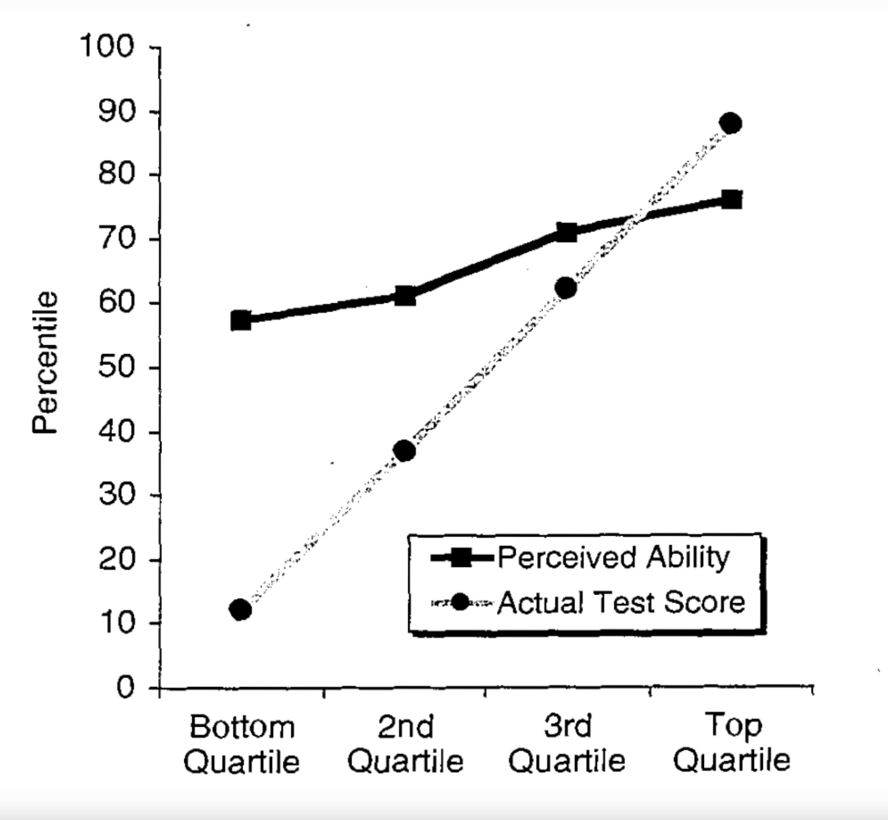
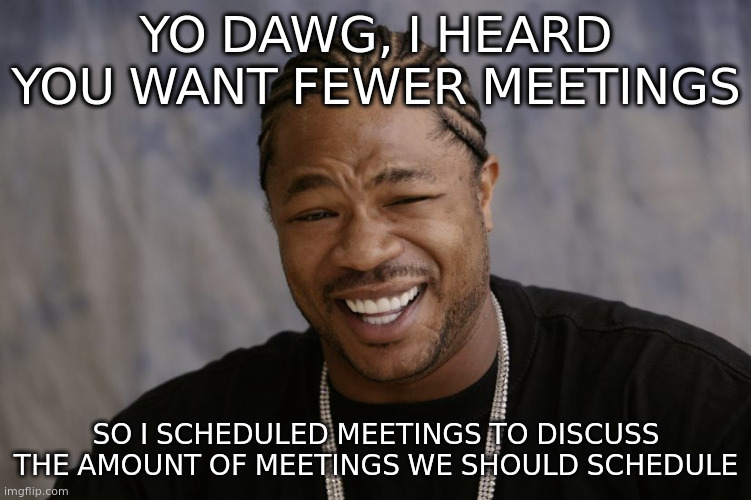
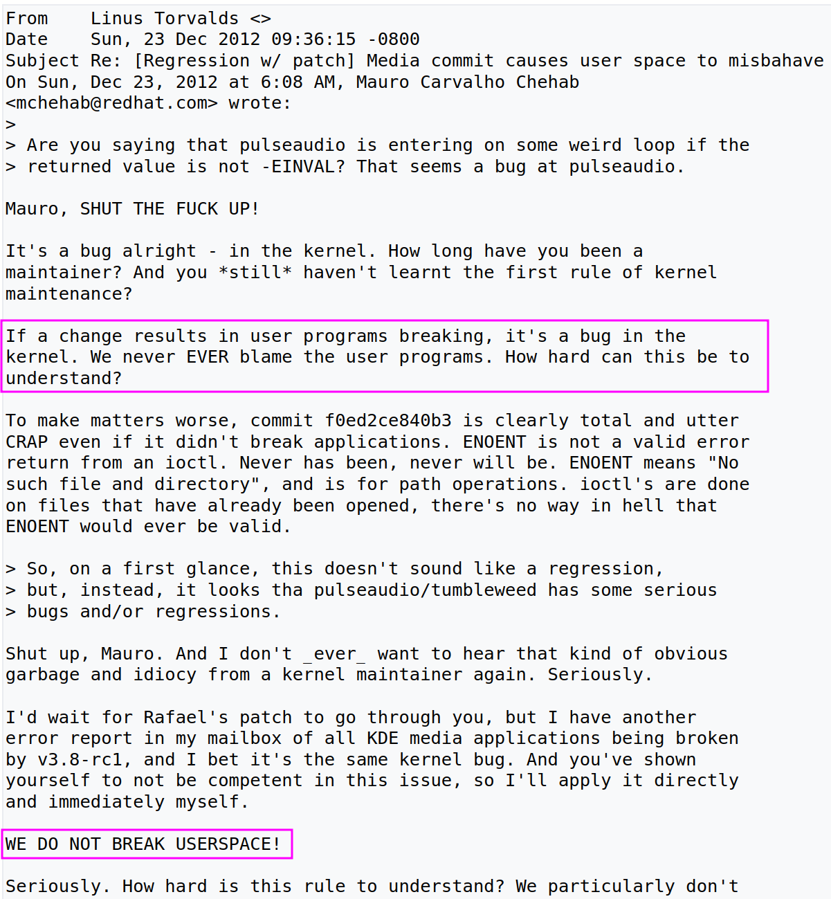

«C'est quoi une Méta-Loi ?», vous demandez-vous ?

Hmm... Revenons à notre protagoniste, Laurie
Notes: N'inspire pas comme Dark Vador, prends ton temps pour inspirer

Notes:Laurie débarque fraîchement dans sa nouvelle boîte Metacortex. Un fleuron de l'industrie du numérique qui recrute dès la sortie d'école pour offrir un avenir radieux dans le développement logiciel !

Notes: Et son manager la colle sur un projet en tant que "Développeuse Front sur la page Panier du site d'Ecommerce d'une grande marque".

Elle aura en charge de contribuer à développer les fonctionnalités de cette page avec son équipe, et elle dépendra intégralement des autres équipes, que ce soit du Back pour récupérer les données du panier, ou encore des autres équipes Front pour récupérer les informations utilisateur.

Laurie s'interroge. Elle est développeuse Web, elle pourrait tout à fait s'occuper du Front, et du Back. D'ailleurs elle a été formée à pouvoir traiter de toutes les couches, de la Conception à l'infrastructure, en passant bien sûr par le Front et le Back

Notes: Et là son manager lui dit:
"Non nous on ne fait que du Front, et encore sur la page Panier. Écoute, tu viens d'arriver, tu es jeune, tu ne sais pas comment ça se passe dans le monde des adultes. Ici chez Metacortex on est très très sérieux et on utilise des méthodes de pointe comme SCRUM, etc. Toi tu t'adaptes. T'es ici pour faire du Front, et uniquement du Front."

Laurie vient de découvrir…

### La Loi de Conway

> Toute organisation qui conçoit un système, produira un système dont la structure est une copie de la structure de communication de l'organisation
Notes: Faire un sondage à main levée pour voir qui connaît

<ul role="list" class="custom-list-types">
  <li data-icon="🛑">Votre architecture est déjà décidée d'avance: Ce sont les équipes de l'entreprise.</li>
  <li data-icon="🙅">Chaque équipe a ses habitudes, son périmètre</li>
  <li data-icon="🍪">« Culture eats Strategy for breakfast. »</li>
</ul>
Notes: Citation de Peter Ferdinand Drucker, un consultant en management

Souci des modifications transverses.

Conséquences à la fois sur les API et aussi sur l'organisation du travail (ticketing) et les dépendances que ça va créer dans les équipes ("on ne sait plus qui fait quoi").

Le lien avec le métier est difficile, car le métier évolue sans que les équipes évoluent forcément

Comment mitiger la Loi de Conway ?
<ul role="list" class="custom-list-types">
  <li data-icon="👷">Intégrer verticalement les équipes (DevOps, FullStack, etc.)</li>
  <li data-icon="🏴‍☠️">Les Mercatos pour mélanger les équipes et diffuser les bonnes pratiques</li>
  <li data-icon="🦄">Valoriser la pluridisciplinarité (Task forces)</li>
</ul>
Notes: Ce ne sont pas les gens qui sont DevOps, ce sont les projets.

Task forces: couper à travers les pyramides managériales.

Bon, c'est pas tout ça, revenons à Laurie

« Et si je virais ce bout de code qui m'a l'air sacrément gratiné… »
Notes: Notre Laurie s'attaque donc à la base de code de son équipe, d'ailleurs entièrement composée de juniors comme elle, et c'est un vrai plat de spaghetti ! Ardente et motivée elle commence à mettre de l'ordre là-dedans, pour vite se rendre compte que quoi qu'elle touche, une autre partie de la page se casse la figure...un vrai Mikado !

Notes: Et elle se fait vite reprendre par ses collègues car tout le sprint en prend pour son grade avec ses bugs à répétition. Oui les boutons sont moches, oui il y a du contenu qui bouge au chargement, mais tout ça c'est pour corriger d'autres bugs bien plus gênants !

La pauvre, la voilà aux prises avec…

### La Palissade de Chesterton

> Tout changement ne devrait être réalisé que lorsque la raison derrière l'état actuel a été comprise.
Notes: Timing: 5:40

«Chesterton's Fence», car c'est basé sur un exercice de pensée autour d'une palissade, que quelqu'un envisage de détruire car il ne voit pas à quoi elle sert. Ce à quoi son compagnon non seulement lui interdit de la détruire, mais l'oblige en outre à déterminer la raison de l'existence de cette palissade AFIN de pouvoir comprendre pourquoi il faut la détruire.

Pas vraiment besoin de vous détailler le lien avec cette naïve Laurie, vous l'aurez compris: toucher à une base de code sans savoir vraiment pourquoi les choses sont comme elles sont vous exposera à la plus sévère des punitions: corriger un bug de Prod en urgence un vendredi à 18 h 30 !

<ul role="list" class="custom-list-types">
  <li data-icon="💰">Les projets "anciens" sont ceux qui paient les factures. Traitons-les avec respect !</li>
  <li data-icon="🧓">Le "Legacy" commence dès le commit. Sa maintenance est une vertu</li>
  <li data-icon="😅">Le code est "gratiné" à cause du poids de l'histoire</li>
</ul>
Notes: Marre du Legacy, qui est souvent un tapis sous lequel on met les "vieux" projets.
Oui, sauf que les projets "anciens" sont en Prod, eux.

Vouloir réécrire à côté c'est prendre un gros risque

Le fameux "On". Pourquoi on a fait ça ? "On m'a dit", etc.

Comment mitiger la Palissade de Chesterton ?
<ul role="list" class="custom-list-types">
  <li data-icon="🤔"><strong>Bon</strong>: Prendre le temps de *comprendre* le Domaine (DDD, par ex.)</li>
  <li data-icon="📝"><strong>Mieux</strong>: Documenter soi-même les règles de gestion (les tests autos !)</li>
  <li data-icon="💪"><strong>Meilleur</strong>: Faire évoluer le "Legacy"</li>
</ul>
Notes:
pas réservé aux POs, archis, etc. ! Notre métier est LITTERAIRE (lire de la doc, écrire de la doc, des ADRs, des messages de commits, etc.)

Loi de Conway n'incite pas à ce genre de réflexion -> "équipes dédiées", d'ailleurs toujours surchargées, qui sont censées s'occuper de tout ça

Règle scout: toujours laisser l'endroit plus propre qu'on l'a trouvé

Allez, on retourne voir comment va Laurie...

Notes: La voilà aux prises d'un individu peu recommandable, un Tech Lead nommé "Michael", qui lui dit qu'elle a intérêt à bosser car la couverture de code est passée en-dessous des 80%, ce qui est contraire à la politique de l'entreprise, et donc que sa PR restera bloquée dans la CI, épissétou !

Notes: Stressée par l'envie de bien faire, elle devient un peu prête à tout, quitte à écrire des tests unitaires juste pour faire remonter le taux de couverture de code au-dessus des 80%, et ainsi éviter les foudres de Sonarqube.

Il faut qu'elle passe la Quality Gate, quoi qu'il en coûte (comme dirait l'autre) !

Pas de bol pour Laurie, elle est tombée en plein dans...

### La cruelle Loi de Goodhart

> Lorsqu'une mesure devient une cible à absolument atteindre, elle cesse d'être une bonne mesure.
Notes: Timing: 9:24.

Les humains sont prédictibles: iels cherchent la voie du moindre effort surtout en situation de stress.

Si vous leur mettez la pression à un sujet, leur énergie sera dépensée non pour atteindre les objectifs,
mais pour pervertir le thermomètre à moindre effort.

Comment éviter de casser le thermomètre ?
<ul role="list" class="custom-list-types">
  <li data-icon="🤨">Arrêtons le "Un problème est survenu; vite, un indicateur !"</li>
  <li data-icon="🦾">Établissons un ensemble <em>limité</em> d'indicateurs de l'équipe sur un périmètre qu'elle <em>maîtrise</em></li>
  <li data-icon="🫂">Suivons avec <em>bienveillance</em>. Un indicateur est simplement une opportunité de s'améliorer</li>
</ul>
Notes: «Un fait divers, une loi»

L'équipe doit être maîtresse de son destin.

Moi je m'impose 115% :D

SLO/A/I: Service Level Objective/Agreement/Indicators

Notes:
Quand je parle de Bienveillance, je ne parle pas des babyfoots, des happenings, etc.

Je parle de ce qui est le plus dur à maintenir dans la durée: un écosystème qui permette à chacun de travailler dans de bonnes conditions, d'avoir la possibilité de donner le meilleur de soi-même, bref d'avoir du sens et de l'autonomie.

Exiger la bienveillance. On est intraitables avec le code tout en étant adorable avec les gens 🤗

Moi, je suis particulièrement concerné, entre le Full Remote, Linux, et Neovim, car c'est pas évident...

Bon, comment elle va, Laurie ?

Notes: Elle en marre de se faire marcher dessus, elle s'est (bon ici, un peu trop littéralement) armée de son expérience pour affronter les métas-lois. Elle est sûre d'elle, très sûre d'elle...trop sûre d'elle ?

### L'effet Dunning-Kruger

> Les personnes ayant une compétence limitée dans un domaine surestiment souvent leurs capacités.

Corollaire:
> Les gens performants ont tendance à sous-estimer leurs compétences dans leur domaine d'expertise
Notes: Timing: 12:24

Notes: Voilà le graph originel de l'étude.
Alors on a dit beaucoup de bêtises sur DK, notamment dans le cadre de l'étude de la porosité des gens à la désinformation. Il y a d'ailleurs apparemment des différences culturelles qui tempéreraient tout ça.

Analyse des bottom performers et top performers

Il y a trois types d'informations:
<ul role="list" class="custom-list-types">
  <li data-icon="😌">Ce qu'on sait</li>
  <li data-icon="🤔">Ce qu'on sait qu'on ne sait pas</li>
  <li data-icon="🤯">Ce qu'on ne sait pas qu'on ne sait pas</li>
</ul>
Notes: Si vous pensez ne pas être affecté par l'effet Dunning-Kruger, vous êtes très probablement affecté par l'effet Dunning-Kruger :)

Détailler, parler du champ des possibles. Illustrer avec les bottoms et top performers.

Pour mitiger, rien de plus simple:
<ul role="list" class="custom-list-types">
  <li data-icon="🏃">Se remettre en question, continuellement</li>
  <li data-icon="👂">Identifier les gens compétents qui se sous-estiment un peu trop</li>
  <li data-icon="🧘">Attention au Syndrome de l'Imposteur: tenter et échouer, c'est aussi apprendre</li>
</ul>

Avec ça, Laurie peut repartir sur des bases saines 😌

« Tout fonctionne sur mon Powerpoint, hein »
Notes: Sauf qu'en rétrospective elle se fait un peu gentiment allumer par l'Architecte, car elle avait dit que son dev prendrait 3j et ça a fini par prendre trois semaines (merci Dunning-Kruger !) donc avec tout ça elle est à la bourre et c'est pas ce qu'il avait prévu dans son joli powerpoint. Et il s'est engagé auprès du client sur le fait que la page Panier serait capable de montrer des vidéos en 4K des produits réservés, donc ça va pas du tout, ça !

Notes: Aïe, oui, ça a pris plus de temps que prévu, car deux sœurs jumelles ourdissaient déjà dans le dos de Laurie...

Qui ? Je veux bien sûr parler de...

### Loi de Hofstadter:
> Ça prendra toujours plus de temps que vous le pensez, même en prenant en compte la loi de Hofstadter.

### Loi de Parkinson:
> Quel que soit le travail à faire, la durée d'une tâche s'étirera pour remplir le temps qui lui est alloué.
Notes: Timing: 15:115

Ou pourquoi les estimations c'est de la daube 🙄

On va commencer par Hofstadter: Les humains sont *catastrophiquement* mauvais dans leurs estimations:

Soit on sous-estime parce que Dunning Kruger, Chesterton, Conway, etc.
Soit on sur-estime parce que bon, on a dit qu'on s'occupait de trois tickets dans le sprint donc on ne pas s'en rajouter plus que ça, hein les gens ! 😉

Notes: Et ça reste un sujet qui fait régulièrement l'actualité !

On a beau faire des story points, des tailles de Tshirts, etc. ça fonctionne rarement.

Notes: Et la Loi de Parkinson, elle, est particulièrement pernicieuse car on va avoir tendance à prendre "la place disponible" dans notre emploi du temps, alors que si on avait rationalisé le temps on aurait pu faire plus de choses.

Et on adore ça les réunions, les rituels...vocabulaire de Religion ça, non ? C'est vous dire à quel point c'est compliqué de remettre ça en cause, on atteint le stade de la croyance. Même si les réunions pouvaient être remplacées par un simple mail, même si c'est devenu un motif pour revenir sur le télétravail, c'est pernicieux à ce point là.

Et le pire ? C'est que Parkinson s'applique aussi aux managers de tout poil, aux SCRUMMasters, POs, etc. Et tout ce monde là va "occuper la place disponible" avec des réunions, à tel point que des fois on se demande si on travaille encore, ou bien si notre travail est devenu, juste, de la réunionnite.

Ben kékonfait alors ?
<ul role="list" class="custom-list-types">
  <li data-icon="👂">Ne pas estimer ? Tentant ! Mais difficile à vendre</li>
  <li data-icon="🏋️‍♂️">Admettre que dans MVP, le "M" veut dire "Minimum": Itérez, itérez, itérez</li>
  <li data-icon="🐷">Soyez francs avec les ROTIs (anonymes !) et privilégiez l'asynchrone</li>
</ul>

Notes:
L'ancien monde et ses deadlines, diagrammes de GANTT, gestion de projet à l'ancienne (on ne fait pas des ponts…)

Trancher dans les MVP, et atteindre le cœur de l'itération.

Concernant les réunions: faut mesurer le ROI, remettre en question l'ODJ, etc.
Privilégier l'asynchrone: avez-vous besoin d'une réunion si la doc est écrite, et si elle est lue ? ADR, etc.

Et, pour aider à la prédictibilité des tâches, on peut par exemple utiliser des «Boring Technologies» (cf L'Effet Lindy).

Notes: En m'entendant parler (oui après tout y a pas que Deadpool qui a le droit de casser le 4e mur), Laurie s'interroge à haute voix:

« Attends, il a dit quoi, là ? C'est quoi, ça, l'Effet Lindy ? »

Notes: Un collègue Senior, d'une antique équipe chargée de maintenir un logiciel de comptabilité en COBOL, entend la question de Laurie et décide d'intervenir pour y répondre.

« En gros, les technologies dites "ennuyeuses", ou "anciennes" sont de bonnes technologies, car elles ont passé l'épreuve du temps »

### L'effet Lindy

> Plus longtemps quelque chose de non-périssable existe ou bien est actuellement utilisé, plus longtemps son espérance de vie s'allonge.
Notes: Timing: 20:17

Je vous laisse vous chauffer le ravioli avec ça deux secondes 😁

<ul role="list" class="custom-list-types">
  <li data-icon="🗻">Ce qui dure a une raison de durer, et cette raison fait que ça continuera à durer</li>
  <li data-icon="👶">Ce qui est nouveau n'a pas encore subi les foudres du réel</li>
  <li data-icon="🙏">La nouveauté doit devenir pragmatique…quitte à y laisser sa jeunesse !</li>
  <li data-icon="💡">Être moderne c'est être contemporain, pas forcément être "meilleur"</li>
</ul>
Notes:
- Le statu quo est cette fois votre allié: se concentrer sur la maintenabilité de ce qui est existe coûte beaucoup moins cher que de faire fonctionner le dernier truc à la mode qui vient de sortir et qui sera probablement has-been dans un an, ou cinq.
- Faire sa veille mais ne pas en faire sa boussole
- Bannir le « CV Driven Development ». Le monde ne tourne pas autour de votre CV. Les utilisateurs se contrefichent que ça aide votre carrière.

Sur ces sages paroles, Laurie repart à l'assaut de sa page Panier
Notes: Elle décide d'appliquer ce qu'elle a appris, et elle se rend compte qu'elle pourrait dramatiquement simplifier son code si elle affichait chaque produit dans une page dédiée: en effet elle pourrait réutiliser la page d'affichage des produits dans le catalogue ! Woah, pourquoi n'y a t'elle pas pensé avant ? En plus ça corrigerait pas mal de bugs qu'elle avait lorsqu'elle s'est prise la Palissade de Chesterton ! Coup double, donc ?

C'est qui la belle complexité ? Oui c'est toi, oui c'est toi !

Notes: Sauf que…Les utilisateurs se plaignent immédiatement d'un tel changement: plutôt que d'avoir toutes les informations sur la page Panier, v'la't'y pas qu'iels doivent maintenant ouvrir chaque produit dans un nouvel onglet pour en voir les détails ? Un scandale !

La complexité, terrifiant, prend des formes multiples, et il faut savoir qui va l'assumer.

Car on ne fait pas ce qu'on veut avec la complexité, à cause de...

### L'implacable loi de Tesler

> La complexité inhérente d'une application ne peut jamais être totalement retirée, ou cachée. On ne peut que la déplacer avec des compromis.
Notes: Timing: 23:33

<ul role="list" class="custom-list-types">
  <li data-icon="😅">Il y aura toujours de la complexité dans votre application</li>
  <li data-icon="💵">Elle est dans votre code (DX), son utilisation (UX), son coût (FinOps), etc.</li>
  <li data-icon="⚖">Trouver le bon équilibre, et se concentrer sur vos forces</li>
</ul>
Notes: Il y a la "bonne" et la "mauvaise" complexité quoi. C'est FORCÉMENT un compromis

Par ex: Une application web interne qui fait du CRUD pour 10 personnes a-t-elle besoin de Kubernetes, ou de Microfrontend ? Le cœur de l'application n'est pas sa scalabilité, ni l'agnosticité du déploiement ! Donc ptet pas justifié

En revanche si votre application contient de l'algorithmique complexe pour éviter à vos utilisateurs d'avoir à jongler entre deux écrans, la question peut se poser. Mais là-aussi il faut être conscient du coût (et pas que financier, la santé mentale de la maintenance aussi c'est un coût)

On en revient à nos différentes technologies, à la veille, etc. Améliorer son discernement pour comprendre la valeur ajoutée de l'application (ou de la couche sur laquelle vous bossez) et qui JUSTIFIE sa complexité.

On n'oppose pas les devs et les users !

Bon, c'est pas tout ça mais Laurie se concentre sur la complexité de son application...
Notes: Et elle voit un truc qui est très débile: quand le Panier est vide, il y a quand même un article, mais avec une quantité à 0 et un prix à 0€. Elle recroise avec sa PO (éviter le Chesterton) qui lui dit que c'est effectivement un vieux bug, mais qu'on s'en fiche car la page Panier n'est pas affichable si le total est nul.

Elle supprime, confiante que ça n'a aucun sens, et en plus ça simplifie son code...

💥...Bug en production ! Le total de la commande dans le header indique `undefined` 😱
Notes: C'est ballot, hein. Voilà que son pire cauchemar se produit...elle est pourtant sûre que ce comportement n'a aucun sens. Il n'est d'ailleurs même pas documenté. Comment est-ce possible que ça serve à quelqu'un un truc pareil ?

Hé oui, les pires cauchemars c'est sa spécialité. Je veux bien sûr parler de...

### La loi d'Hyrum, ou le Contrat Involontaire

> Dès que vous atteignez un certain nombre d'utilisateurs de votre API, votre contrat ne sert plus à rien: Tous les comportements de votre système seront utilisés tels quels par quelqu'un
Notes: Timing: 25:59

Ce qu'il s'est passé c'est que l'équipe qui est en charge du header se servait de ce comportement pour afficher le total de la commande, et comme maintenant il n'y a plus d'article dans le panier, ben ça devient undefined.

Et en plus ce code tout pourri ils ne vont pas le changer parce que tu comprends Laurie y a un NOUVEAU HEADER qui va arriver et remplacer ce header Legacy tout pourri donc…rollback stp !

Notes: There's always an XKCD for that :D

Ça paraît assez facile à mitiger, sur le papier:
<ul role="list" class="custom-list-types">
  <li data-icon="😅">N'exposez que ce qui doit l'être</li>
  <li data-icon="📣">Communiquez largement les changements</li>
  <li data-icon="🤓">Semver est un <em>mensonge</em></li>
  <li data-icon="😤">Testez, testez, testez</li>
</ul>
Notes: Il faut arrêter de se cacher derrière son petit doigt et accepter que toute mise à jour (oui, même un patch) peut être un Breaking Change.

Et même, documenter les changements c'est pas facile. Celleux qui ont déjà faite une CHANGELOG le savent.

Et, pour les briques qui sont utilisées par des clients internes, rappelez que le client est tout autant responsable de ce qu'il accepte que vous êtes responsables de ce que vous livrez: ils ont le droit, et l'obligation morale, de faire des tests, non mais !

Notes: Rappelez vous Linus Torvalds: WE DO NOT BREAK USERSPACE!

D'ailleurs on pourrait légitimement me faire remarquer que Linus n'est pas très bienveillant, là, mais au-delà de la forme, son message est un message de bienveillance à l'égard de _ses_ utilisateurs. S'il pète un câble, c'est bien parce que l'un des mainteneurs du noyau a décidé de privilégier son expérience aux dépens de celle de ces utilisateurs. C'est là qu'est le drame !

Notez d'ailleurs qu'il attaque le code, la solution, mais pas la personne. C'est ça de la bienveillance. On a le droit de se tromper, mais on n'a pas le droit de ne pas le reconnaître. Bon il aurait pu y aller moins fort, mais est-ce qu'on s'en serait souvenu ?

Il l'a fait là, contre nvidia, au sujet de l'intégration de Rust dans le Kernel, etc.

« Bonjour la Guilde, j'ai fait une PR pour mettre à jour le framework maison »
Notes: Laurie, voulant bien faire, va faire une modification (pour une fois) bien appropriée dans l'un des nombreux repos du projet, pour sa page panier. Car bien sûr que même sur sa page de prédilection, elle doit quand même aller demander le droit d'aller modifier des choses, car c'est """transverse""".

Notes: Sauf que bon, elle n'a aucune idée que sa PR, son besoin, est le cadet des soucis de la Guilde, qui a des choses beaucoup plus importantes à faire, comme débattre de la plus belle manière d'arranger des ternaires avec Prettier, ou encore si on change le % de couverture de code...

Elle n'a qu'à ouvrir un ticket et on lui répondra un jour, peut-être, si on a du temps et l'envie de le faire.

En voilà un personnage qui illustre magnifiquement…

### Le Principe de Shirky

> Toute institution essaiera inconsciemment de préserver le problème qu'elle est censée résoudre.
Notes: Timing: 31:44

La siloisation n'a jamais de limite. Elle s'insinue, puis elle se bureaucratise (ticketing), et ensuite vous ne pouvez. plus. l'extirper.

Comme toujours ce genre d'initiative part d'une bonne intention: on veut rationaliser les efforts, on veut éviter que "ça dérive", on veut garder le contrôle, parce que les devs, forcément, ils sont pas doués.

Et l'Enfer est pavé de bonnes intentions. Et vous risquez Goodhart, de la toxicité, etc. PÉDAGOGIE

<ul role="list" class="custom-list-types">
  <li data-icon="🛑">Les "Guildes", "Design Authority", et autres services "Support" qui verrouillent tout</li>
  <li data-icon="🔒">Les écosystèmes incompatibles avec le DevOps (merci Conway !)</li>
  <li data-icon="🙄">« C'est pas nous, c'est l'Équipe Support XYZ qui nous bloque ! »</li>
</ul>
Notes: L'Enfer est pavé de bonnes intentions. Vraiment, je vais le répéter. L'Enfer est PAVÉ DE BONNES INTENTIONS.

Les services "Support" doivent intégrer leur nom: ce sont des services qui sont censés "supporter" le développement des fonctionnalités. Ça peut bien évidemment être des "lignes de défenses", car il y a tout un tas de domaines où les devs ne peuvent être experts, bien sûr.

Mais à partir du moment où on monte dans sa tour d'Ivoire et qu'on a jeté la clé, c'est terminé. Vous n'êtes plus un service support mais un service "chien de garde".

(dernier item) Et c'est bien pratique pour certaines équipes de Dev qui fuient leur responsabilités, hein. Tout le monde est concerné par cette histoire !

Alors soyons un peu positifs:
<ul role="list" class="custom-list-types">
  <li data-icon="😌">Le point de départ doit être l'"Utilisateur"</li>
  <li data-icon="👮">« Rendre impossible à représenter les états invalides »</li>
  <li data-icon="🎭">Stop au "Théâtre de la Sécurité"</li>
</ul>
Notes: Ce que je veux dire par « Rendre impossible à représenter les états invalides », c'est de faire en sorte que vos devs ne peuvent _physiquement_ pas se retrouver dans une situation qui serait inadmissible. Un moyen pour la partie Ops, par exemple c'est d'envisager du Platform Engineering de manière à proposer en self-service des capacités de déploiement aux Devs pour éviter qu'ils vous montent un cluster k8s n'importe comment dans un coin parce que Dudule il l'a fait en bootcamp.

Le Théâtre de la Sécurité, plus largement, c'est cette apparence de "la sécurité pour valider des audits" qui n'apporte aucune sécurité, mais qui valide que vous avez bien faite le webinaire de 2h en temps et en heure. C'est un peu comme le Sentiment d'Insécurité, comme on peut difficilement lui coller un KPI (rappelez-vous Goodhart !), on trouve un peu n'importe quoi histoire d'avoir une courbe qui monte ou qui descende en fonction du gain politique.

La réalité, elle, on s'en moque. Même si la Réalité, elle, continue son petit bout de chemin malgré tout ça.

L'idée, en somme c'est d'arriver à ça:

Mon service support préféré 💗
Notes: Et c'est pas être une diva que de demander ça. Parce que ça c'est ce qu'on attend que les Devs disent aux clients

(et je me tue à le dire à mes clients d'ailleurs)

Bref, disruptez, bousculez, interagissez, remettez en question, piratez vos organisations ! :V
Vos clients internes et externes vous en seront reconnaissants (et envoyez-moi les récalcitrants...)

Il y aurait encore beaucoup à dire sur les Meta-Lois...
Notes: Timing: 40:00

Mais je vais commencer à manquer de temps, c'est d'ailleurs pour ça qu'il y a quelques temps j'ai décidé de répertorier dans un dépôt Git celles qui s'appliquent plus ou moins à notre métier.

Et sachez qu'il n'y a pas que l'informatique qui a des Méta-lois, il y a une page Wikipédia qui essaie de toutes les répertorier ! Je la cite dans mon repo donc vous verrez ça vous même.

Notes: Ça y est, Laurie est désormais un peu mieux armée pour survivre dans le monde merveilleux du développement logiciel. On le voit pas à sa tête ? Oui bon elle a pris un coup de vieux, hein, ça nous arrive à tous et à toutes 😅

Notes: La raison pour laquelle j'ai décidé de vous parler de ce sujet qui continue de beaucoup m'intéresser encore aujourd'hui, c'est afin de pouvoir mettre des mots sur des situations plus ou moins malheureuses qu'on a tous et toutes rencontrés à un moment.

Et mon idée est de vous donner des outils afin de vous permettre d'identifier, puis de combattre efficacement les méta-lois.

Car sinon vous risquez de subir...

### Le marteau de Maslow 🔨

> Si le seul outil que vous avez est un marteau, tout finit par ressembler à un clou.
Notes: Appelée aussi la loi du marteau en or, on encore la Loi de l'instrument

C'est en particulier applicable aux hard-skills. Si vous ne connaissez qu'un langage, qu'un framework, qu'un paradigme (comme le FrontEnd), comment voulez-vous être utile dans la durée pour vos utilisateurs et vos utilisatrices ?

J'ai un autre talk autour d'HTMX qui parle un peu plus de cette remise en question.
