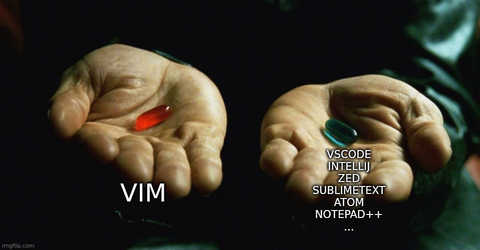

<!-- .slide: data-background="#ff0000" -->
FIX LES QR CODES

"Attends, Stéphane, tu utilises VIM pour coder ? T'es cinglé ?"
Notes: Je suis là pour une seule raison: Parce que j'ai entendu cette phrase une fois de trop.

Notes: Je ne suis pas fou: Je suis simplement sain d'esprit dans un monde cinglé.

Notes: Il se trouve que j'ai avalé il y a bien longtemps la pilule rouge, après avoir été écœuré par les autres pilules bleues.
