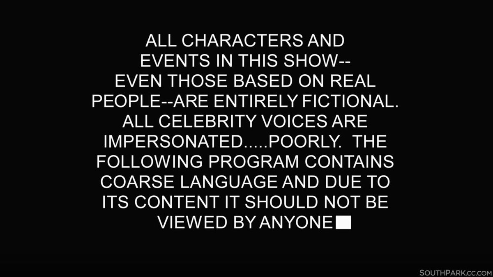
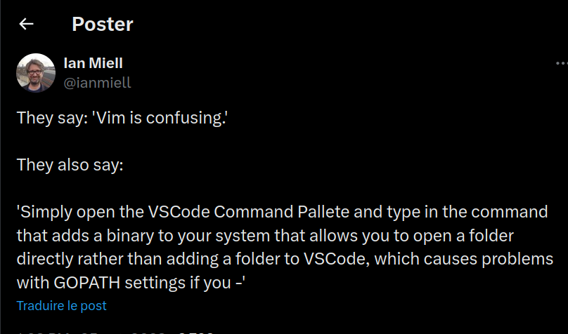
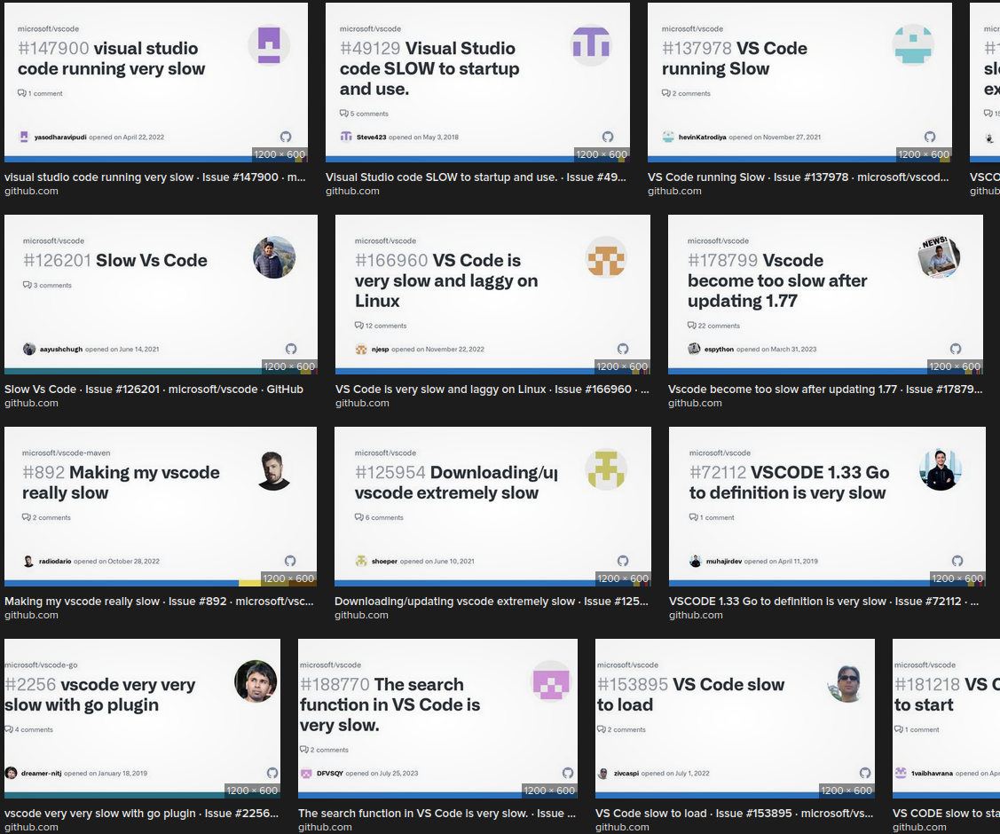
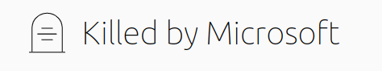
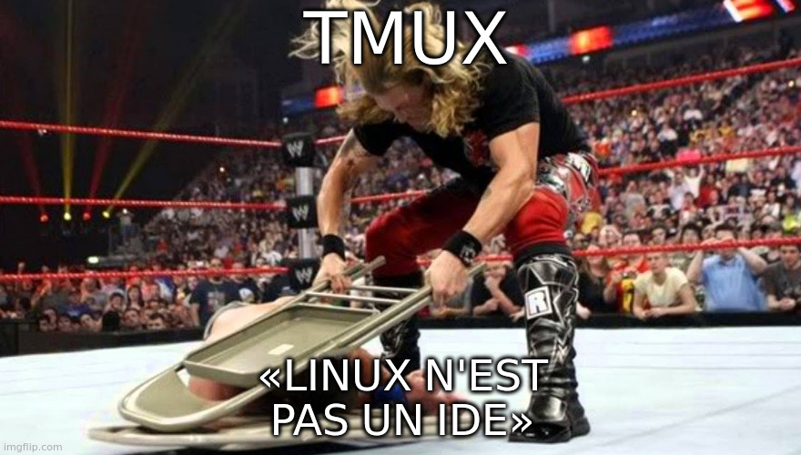
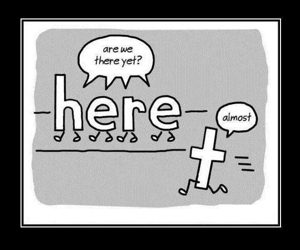
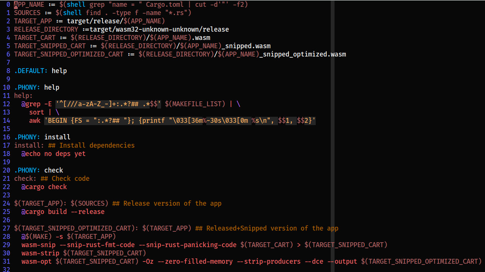
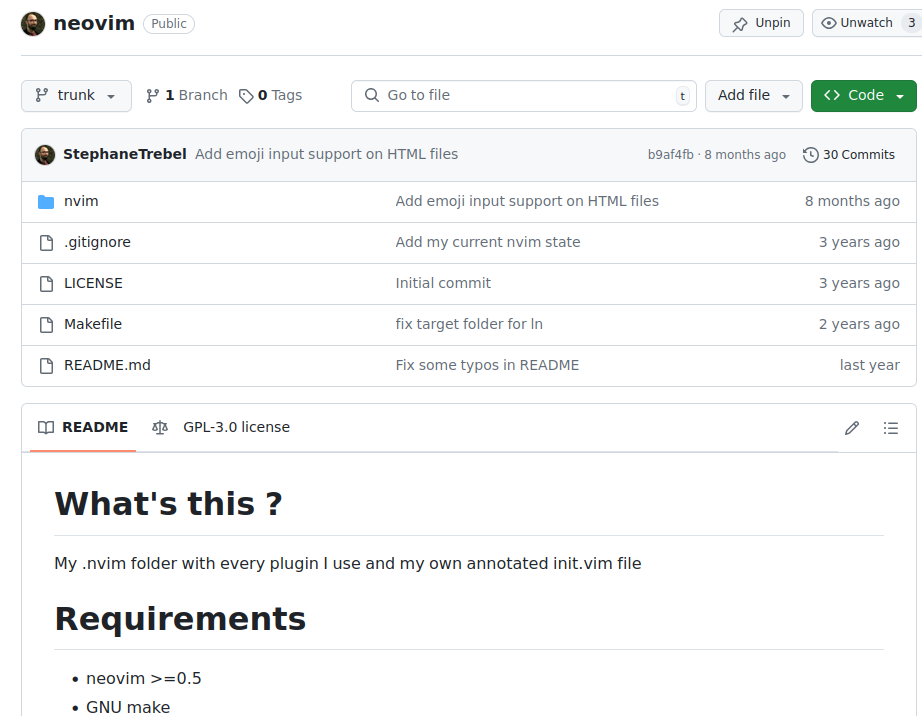

## De quoi qu'on va causer:

<ul role="list" class="custom-list-types">
  <li data-icon="💻">De mon éditeur de texte/code</li>
  <li data-icon="💪">De ce qu'il lui manquait pour devenir un "IDE"</li>
  <li data-icon="😎">De comment j'ai connecté tout ça pour en arriver à <em>mon</em> "IDE"</li>
</ul>
Notes: On va partir du cœur du sujet, Vim, et ensuite on va introduire un autre invité, pas assez connu à mon goût, et enfin étendre la discussion à ce que j'entends, moi, par "IDE".


Vim, une histoire d'amour tardive
Notes: J'ai utilisé plusieurs éditeurs, notepad bien sûr (sans le ++ hein), beaucoup SublimeText à l'époque 2012-2015, puis je suis passé sur Atom (RIP).

Mais à chaque éditeur il y avait toujours quelque chose qui me gênait…


- Coloration syntaxique jamais satisfaisante
- Plugin nécessaire pour faire X ou Y (Git, par ex)
- Ça se met à ramer au bout d'un moment…
- «Woah, le nouvel IDE à la mode ! VSCode, ça s'appelle ? C'est super, mais faut tout réapprendre 😫»


Et en parallèle, la découverte de mon véritable ennemi…


Notes: Ah non, pas cette souris-là, recouche-toi Jerry ! Désolé !


Notes: Cet ennemi-là ! Oui ! LA SOURIS ! 😠


Notes: Il n'est pas difficile de trouver des études qui établissent le lien manifeste entre certains TMS et l'utilisation régulière de la souris, et même pire: sur l'alternance entre utilisation du clavier et de la souris !

C'est bel et bien CE GESTE, qui va vous fiche le poignet en l'air !



Notes: Alors loin de moi l'idée de vouloir la fin des pointeurs de toute sorte (souris, trackballs, etc.).
Je sais que ce sont des outils qui sont parfois le seul moyen d'interagir avec les interfaces utilisateurs.
Mais quand on a la maîtrise de ses dix doigts, quelle PURGE de devoir les soulever pour aller poser sa main sur cet instrument du démon !



Notes: En plus de tout ça, je commençais à pas mal fatiguer de la fameuse "simplicité" vantée par les Éditeurs de Texte dits "modernes" alors qu'ils ont beaucoup de mal à gérer ce qui arrive après eux…



Notes: Donc oui, tout ça à commencer à me lasser, d'autant que c'est censé être mon outil de travail…



Notes: Et pour finir, qui me garantit que mon éditeur va vivre sur des années et ne pas rejoindre la trop longue liste des outils et services abandonnés par leur éditeur, qui n'est après tout qu'une (petite) entreprise ?


Notes: C'est à peu près à ce moment-là que j'ai rencontré ce gars-là. Un sysadmin Linux qui fait honneur à cette terminologie en étant en parallèle un développeur C/C++ qui sait ce qu'il fait.

Et un Vimiste confirmé.

Mon mentor sur Vim, donc.

«Pourquoi tu te prends la tête avec l'éditeur X ou Y alors que tu pourrais n'avoir qu'un seul éditeur, open source, existant déjà sur quasiment tous les serveurs, et pour aussi longtemps que tu le veuilles ?»

C'est comme ça que je suis devenu Vimiste, puis Neovimiste 😁


Assez causé, ptite démo !


Notes: À montrer
- Plusieurs modes (Normal, Insert, Command, Visual)
- Les "mouvements", composables, permettent les actions
- Les commandes (s// g//, etc.)
- Les plugins (LSP, l'IA, etc.)
- Les configs
- Et tout le reste (la leader key, les buffers, les macros, etc.)


C'était bien, hein ? 😌


On récapitule:
- Plusieurs modes (Normal, Insert, Command, Visual)
- Les "mouvements", composables, permettent les actions
- Les commandes (s// g//, etc.)
- Les plugins (LSP, etc.)
- Les configs
- Et tout le reste (la leader key, les buffers, les macros, etc.)


Un développeur pratiquant Vim régulièrement
Notes: Plus je pratique vim, plus j'aime pratiquer vim. Aucun éditeur ne m'a fait ressentir ça !

C'est fun, c'est de la muscle memory (et donc de la charge cognitive en moins)

On a un canal slack:  #vim

Recommandations: Articles de blog mouselessdev


« Ok, ok, mais ça n'en fait pas un IDE ! »
Notes: On s'en rapproche, non ? Déjà je ne sais pas combien d'entre vous avaient connaissance du rôle des LSPs, ou des plugins, qui aident pas mal à retrouver des fonctionnalités qu'on pensait "réservées" aux IDE/éditeurs dits "modernes".

Mais, effectivement, il manque un "je ne sais quoi" pour transcender l'expérience

Et puis…


Bah oui, la conf' s'intitule "Neovim est mon éditeur, Linux est mon IDE", hein 😅





Un gestionnaire de session superchargé à l'efficacité:
- Des "sessions"
- Des "fenêtres"
- Des "panneaux"
- Une leader key (tiens, tiens !)
- Et des plugins (très peu mais bien utiles !)


What time is it ? It is Dora time !


Bon, on a un éditeur, et un gestionnaire de "mini-terminaux" bien pratique.



Reste à assembler tout ça avec notre meilleur ami: GNU/Linux 🤗


Différents cas d'usage:


Ouvrir un lot de fichiers dans Vim:

```bash
$ vim $(find templates/ -iname "*.yaml")
```
et ainsi je n'ai plus qu'à parcourir les buffers ainsi créés 😉


Gérer un conflit Git: `git` + `vim`
```toml
[merge]
	ff = only
	conflictstyle = diff3
	tool = nvimdiff
[mergetool "nvimdiff"]
	cmd = "nvim -d \"$LOCAL\" \"$MERGED\" \"$REMOTE\""
```

puis:

```bash
# Quand il y a un conflit Git:
$ git mergetool
```


Surveiller des fichiers:
```bash
$ find . -type f -not -path "*target*" -not -path "*.git*" \
  | entr -r -s "cargo test"
```

…et là j'ai de quoi faire du TDD en Rust ! 💪



Et si ça va plus loin…un Makefile !


Alors, est-ce que tout ça, ça fait un "IDE" ?


P'tet ben qu'oui, p'tet ben qu'non




Mais c'est <em>mon</em> "IDE"


Et c'est ça qui compte 💗
