Bienvenue ! 👋
Notes : Bienvenue tout le monde !


Rust 🦀 est connu pour être un langage qui favoriserait le "bas-niveau"...


Notes : Ajouter une image d'exemple "embedded"


Pour des masochistes férus d'optimisations mémoire...


Notes : Meme borrow checker


À la syntaxe souvent qualifiée d'exigeante, quand ce n'est pas carrément "cryptique"... 🤯

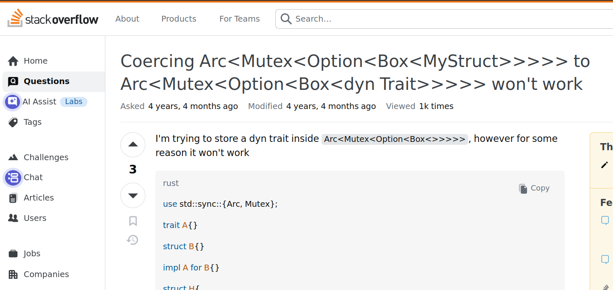
Notes : Mind blown sur le Arc<Box<Dyn<Mutex<UltraInstinct<SSJ4<String>>>>>>


Et si je vous disais que tout ceci est probablement vrai, mais que ce n'est pas pour ça que Rust m'intéresse ?


Notes : C'est vrai, en plus


🦀Rust, pour des applications métiers 🦀
Notes : "applications métiers", c'est à dire de bonnes vieilles applications qui ont pour objectif la modélisation de processus qui ont des conséquences sur la vie réelle, sans pour autant dépendre d'un matériel spécifique.

Donc pas d'embarqué, pas vraiment de contraintes en dehors de ce qu'on connaît: des WebApps qui causent avec une base de données et 2/3 trucs autour (de l'IAM, par ex)


Un système typal expressif et multi-paradigmes
Notes : À vos souhaits. Promis je ne vais pas vous expliquer le Arc<Mutex>


La base: Structs, et "Newtypes"


Un cas ultra-classique:
```rust
pub struct User {
    pub email: String,
}

fn ma_fonction(user: User) {
  if !user.email.contains("@") {
     // Gestion de l'erreur, etc.
  }
  // On continue...

  // Possible, mais pas voulu -> Bug !
  let city: String = user.email
}
```
Notes : Nul. On va devoir multiplier les types partout.
Re-nul. "String", ça ne veut rien dire, on met un email dans une variable qui contient une ville ?
Non mais allo, quoi !


Encoder la logique métier, le rêve ! 😌
```rust
use crate::domain::UserEmail;

pub struct User {
    // Attendez…c'est quoi ça ?
    pub email: UserEmail,
}
```
Notes : Exemple canonique, on veut créer un utilisateur, on a besoin de son email.

Ici, pas de String qui voudrait dire tout et n'importe quoi. On type tout fortement (sinon, ça va hurler à la compilation)


On "impl"émente la logique pour traiter les cas :
```rust
use validator::ValidateEmail;

#[derive(Debug)]
pub struct UserEmail(String);

impl UserEmail {
    pub fn parse(s: String) -> Result<UserEmail, String> {
        if s.validate_email() {
            Ok(Self(s))
        } else {
            Err(format!("{} is not a valid user email", s))
        }
    }
}
```
Notes : Un newtype va "emballer" un type (ici String)

Très pratique car un UserEmail n'est pas un String, ni n'est équivalent à un autre NewType(String) -> compilateur pas content si on mélange -> pas de Duck Typing

On délègue la validation elle-même à une "crate" (on reviendra là-dessus), un lib externe, quoi


Comment on valide ça ? Avec des tests ! 🤩
```rust
#[cfg(test)]
mod tests {
    #[test]
    fn email_missing_at_symbol_is_rejected() {
        let email = "stephanedomain.com".to_string();
        assert_err!(UserEmail::parse(email));
    }

    #[test]
    fn email_missing_subject_is_rejected() {
        let email = "@domain.com".to_string();
        assert_err!(UserEmail::parse(email));
    }
}
```
Notes : On reviendra là-dessus, mais les tests sont colocalisés avec le code.


💥 Un newtype n'est pas égal à un autre type !
```rust
pub struct Address(String);
pub struct UserEmail(String);

pub struct User { pub email: UserEmail }

let my_user = User {
  // Erreur ! Pas un UserEmail, mais un String !
  email: "steph@mydomain.com"
}

let my_user = User {
  // Erreur ! Pas un UserEmail, mais un Address !
  email: Address("steph@mydomain.com")
}
```
Notes : Et c'est ce qu'on veut !


Il faut utiliser le newtype prévu :
```rust
use crate::domain::UserEmail;

pub struct User {
    pub email: UserEmail,
}

let my_user = User {
  // Ok 👍
  email: UserEmail::parse("steph@mydomain.com")?;
}
// Note: Pour l'instant le `?` c'est "magique" 🪄
```


Notes : Un principe fondamental en Rust.
Lié à la philosophie Impureim: on veut au plus possible travailler dans un univers "pur", sans effects secondaires, qu'on maîtrise.

On _encode notre logique_ -> Type Driven Development.


L'Α et l'Ω du Type Driven Development:

Le Pattern Matching


Exemple avec un enum (tout bête) :

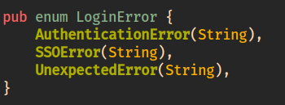


Si on veut pouvoir l'utiliser, on peut s'aider de `match`


Fort heureusement on a ce qu'il faut avec le LSP de Rust 😌


Et y a plus qu'à remplir !

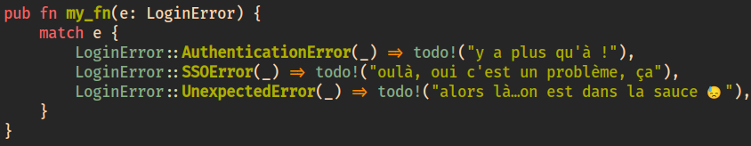


<!-- .slide: data-background-image="assets/pattern-matching-filled-match-arms-with-if.png" data-background-size="contain" -->


Et on peut aller très très loin !
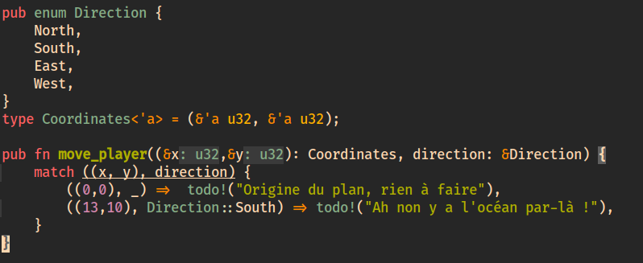


<!-- .slide: data-background-image="assets/pattern-matching-advanced-with-error.png" data-background-size="contain" -->


Finalement, tout s'arrange 😉
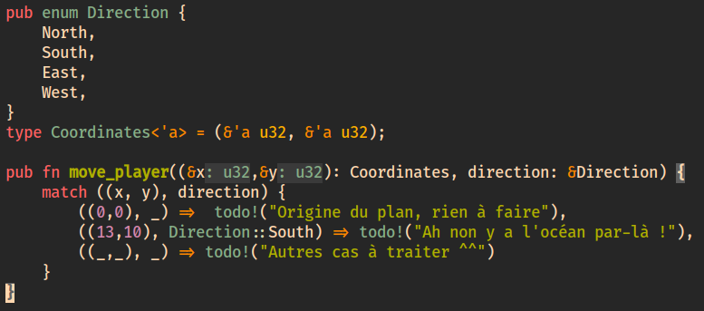


Les "Boîtes" de Rust


"Mais, attends, c'est quoi Result, Ok, et Err ?"
```rust
use validator::ValidateEmail;

#[derive(Debug)]
pub struct UserEmail(String);

impl UserEmail {
    pub fn parse(s: String) -> Result<UserEmail, String> {
        if s.validate_email() {
            Ok(Self(s))
        } else {
            Err(format!("{} is not a valid user email", s))
        }
    }
}
```


<!-- .slide: data-background-image="assets/kahoot_billion_dollar_mistake.jpg" data-background-size="contain" -->
Notes : Toutes les réponses sont valables, mais une l'est historiquement


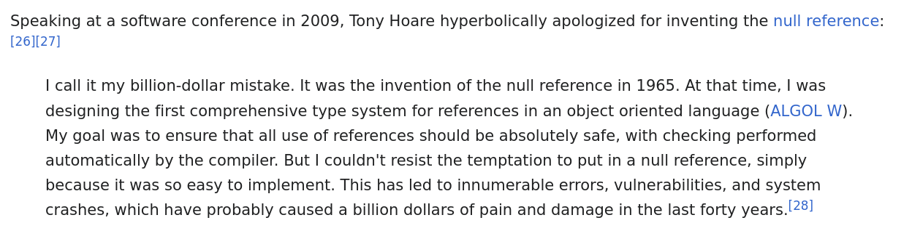
L'ajout de `null` à Algol W, et sa réplication dans (presque) tous les languages qui l'ont suivi
Notes : Dont Javascript, et c'est la raison pour laquelle Microsoft dépense une fortune dans mon linter préféré (TypeScript)


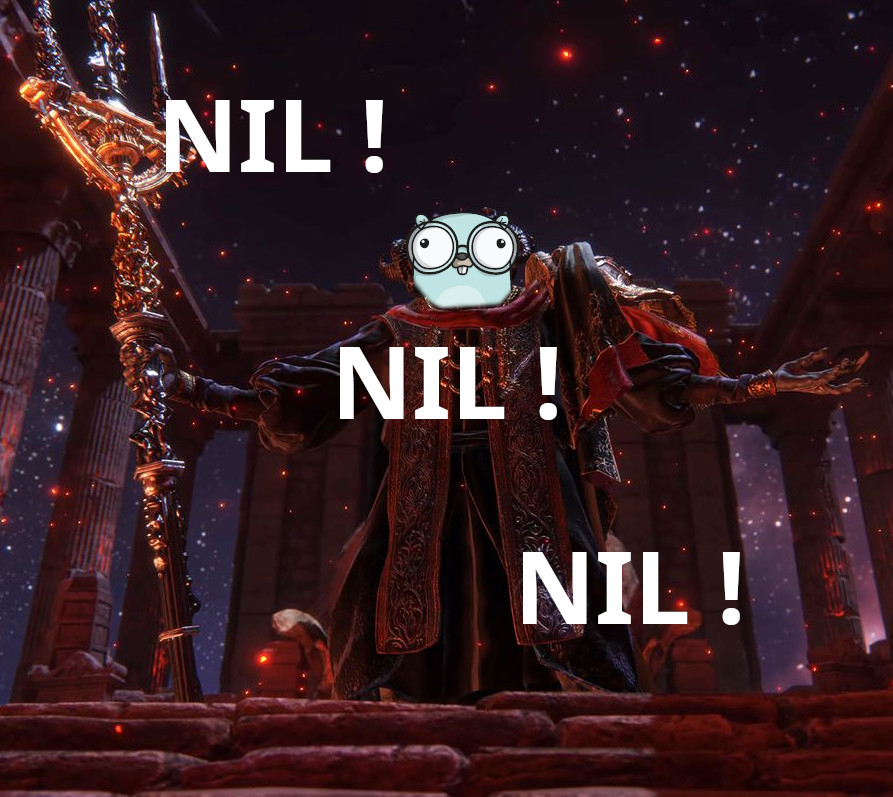
Notes : En Rust, pas de gestion de erreurs en tant qu'exceptions (Java/JS), ni en tant que valeur (Nil)


 dans Rust">
Notes : Either Monad, mon amour


Un Result étant un Enum (`Ok` ou `Err`), on peut le `match`
```rust
/// validate_credentials:
///   (Credentials)-> Result<Uuid, LoginError>
match validate_credentials(credentials).await {
}                       ╭Choose action ─────╮
                        │1. Fill match arms │
                        ╰─────────────────╯
```


Et y a plus qu'à remplir !
```rust
match validate_credentials(credentials).await {
    Ok(_) => todo!("rajouter le cas où tout est ok"),
    Err(_) => todo!("rajouter la gestion d'erreur"),
}
```


Finalement, on met le code final:
```rust
match validate_credentials(credentials).await {
  Ok(user_id) => {
    return HttpResponse::SeeOther()
      .insert_header((LOCATION, "/admin/dashboard"))
      .finish());
  }
  Err(e) => {
    return login_redirect(LoginError::AuthError(e));
  }
}
```


"On est obligés de gérer à chaque fois `Ok` et `Err` ?"
Non, y a `.unwrap()` pour ça
```rust
/// In this case, we ALWAYS have an IP Address
let port = listener.local_addr().unwrap().port();
```


Mais pourquoi qu'on s'inflige le `match`, alors ?

Parce que l'alternative est... pire.


Et même les plus gros se font avoir :

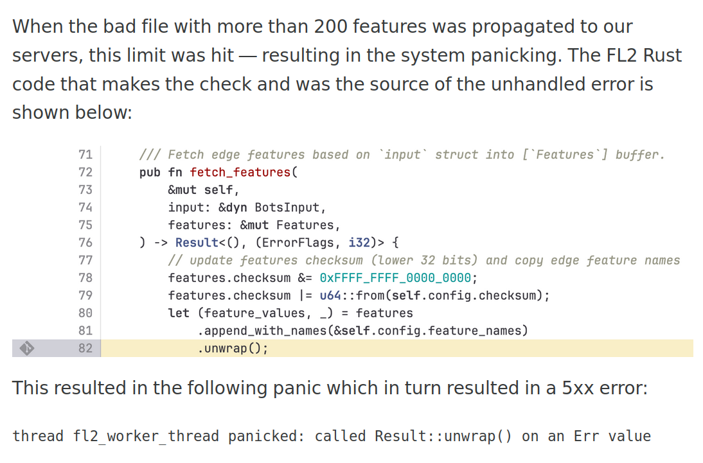


Réservez `.unwrap()` pour le code de test et apprenez à propager ou gérer les `Result`
```rust
fn my_function() -> Result<PortNumber, Error> {
  /// In this case, we SHOULD have an IP address.
  /// If not, bubble up the error upwards
  let port = listener.local_addr()?.port();
  return port;
}
```


D'ailleurs, en parlant d'erreurs...


`anyhow` et `thiserror`, les jumeaux surdoués de la gestion d'erreur.
Notes : Si les erreurs sont relous à gérer, vous les gérerez mal, et c'est là qu'il y aura des bugs.
Fort heureusement, la communauté Rust a tout prévu ^^


`thiserror`, les erreurs faciles à décrire :
```rust
use thiserror::Error;
#[derive(Error, Debug)]
pub enum DataStoreError {
  #[error("data store disconnected")]
  Disconnect(#[from] io::Error),
  #[error("the data for key `{0}` is not available")]
  Redaction(String),
  #[error("invalid ({expected:?}, found {found:?})")]
  InvalidHeader {
      expected: String,
      found: String,
  },
  #[error("unknown data store error")]
  Unknown }
```
Notes : thiserror va automatiquement faire le lien entre des erreurs et leur traduction (Display), juste avec des proc macros (donc zero cost abstraction).

Ce code est tiré de la doc officielle de la crate.

Notez d'ailleurs l'enum: toutes les erreurs sont exhaustivement décrites ici (permettant d'utiliser le pattern matching)


`anyhow`, les erreurs faciles à créer et propager :
```rust
use anyhow::{Context, Result};

// Le Result ne précise même plus le type d'erreur
// car ce sera un `anyhow::Error` 👌
fn main() -> Result<()> {

  // .context permet d'emballer l'erreur avec…du contexte 😁
  it.detach().context("Failed to detach the thing")?;

  // L'utilisation de `?` veut simplement dire:
  // Si c'est une `Err` alors on bubble up !
  // Sinon on "ouvre" la boîte `Ok` et on prend son contenu
  let content = std::fs::read(path)?;
}
```
Notes : C'est plus simple quand on n'a plus à y penser.

Ce code est tiré de la doc officielle de la crate.


Traits, la POO turbo-chargée
Notes : Pas d'héritage, pas de "abstract static final etc.". Une composition simple de méthodes


<!-- .slide: data-background-image="assets/traits-in-one-picture.png" data-background-size="contain" -->


Comme pour les enums, on peut utiliser le puissant LSP de Rust

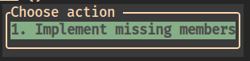


<!-- .slide: data-background-image="assets/trait-implemented-missing-members.png" data-background-size="contain" -->


Les traits "standards"


Un exemple simple: J'ai une `LoginError`, et je veux la déboguer
Notes : Par exemple, j'ai un test qui plante et je veux comprendre pourquoi


Une "fonction" super pratique: `dbg!(my_error)`
```rust
let my_error = LoginError::AuthError("Oulà !");
dbg!(&my_error)
```


Sauf que LoginError n'est pas un type élémentaire...
```rust
`LoginError` doesn't implement `std::fmt::Debug`
add `#[derive(Debug)]` to `LoginError` or manually `impl
std::fmt::Debug for LoginError`

Related information:

  * error.rs#53,18: required by a bound in `Error`
  * post.rs#18,1: consider annotating `LoginError` with
    `#[derive(Debug)]`

 (rustc E0277)
────────────────────────────────────────────────
https://doc.rust-lang.org/error-index.html#E0277
```
Notes : Regardez la puissance du message d'erreur !


Une solution, simple et bien pratique dans 90% des cas : `#[derive()]`
```rust
#[derive(Debug)]
pub enum LoginError {
    AuthError(Error),
    UnexpectedError(Error),
}
```


Ok pour les cas de base, mais implémenter explicitement `Debug` (ou autre trait) ?


Encore une fois, le LSP est là pour nous aider 😍
```rust
pub enum LoginError {
    AuthError(String),
    UnexpectedError(String),
}

impl std::fmt::Debug for LoginError {}
              ╭Choose action ─────────────╮
              │1. Implement missing members │
              ╰─────────────────────────╯
```


On obtient une implémentation "par defaut", qu'on peut customiser 🤤

```rust
impl std::fmt::Debug for LoginError {
  fn fmt(&self, f: &mut fmt::Formatter<'_>) -> fmt::Result {
    match self {
      Self::AuthError(arg0) =>
          f.debug_tuple("AuthError").field(arg0).finish(),
      Self::UnexpectedError(arg0) =>
          f.debug_tuple("UnexpectedError").field(arg0).finish(),
    }
  }
}
```


Et on y met ce qu'on veut

(tant qu'on respecte le Trait, bien sûr)

```rust
impl std::fmt::Debug for LoginError {
    fn fmt(&self, f: &mut Formatter<'_>) -> Result {
        writeln!(f, "{}\n", e)?;
        let mut current = e.source();
        while let Some(cause) = current {
            writeln!(f, "Caused by:\n\t{}", cause)?;
            current = cause.source();
        }
        Ok(())
    }
}
```
Notes : Ici j'utilise .source() pour remonter la chaîne d'erreurs


Ce qui nous permet d'avoir un détail de l'erreur bien plus clair en debug :
```rust
Failed to log in user.
Caused by:
    Failed to retrieve user informations
Caused by:
    error returned from database
Caused by:
    table "user" does not exist
```


La "blanket implementation" d'un Trait pour un Type


Notes : L'art d'implémenter des méthodes pour d'autres types.


Idée: Ça serait pas mal de facilement "convertir" un type en un autre 🤔
```rust
struct FormData {
    key: String,
}

let secure_key: SecurityKey = form.key
  .try_into()
  .map_err(error_400)?;
```
Notes : Et s'éviter ainsi d'avoir à appeller le .parse() qu'on a écrit


`SecurityKey` a une _blanket implementation_ pour le type `String` 💡
```rust
impl TryFrom<String> for SecurityKey {
type Error = anyhow::Error;
fn try_from(s: String) -> Result<Self, Self::Error> {
    if s.is_empty() {
        anyhow::bail!("The security key cannot be empty.")
    }
    let min_length = 50;
    if s.len() < min_length {
        anyhow::bail!(r#"The security key must be
        longer that {min_length} characters"#)
    }
    Ok(Self(s))
}}
```
Notes : Suffit d'importer `SecurityKey` et cet `impl` et le tour est joué !


Et des types/traits/boîtes comme ça, vous en avez PLEIN, dans Rust 🤩
- `Option` (`Some<…>` ou `None`)
- `Debug` vs `Display`
- `Deref`
- `Drop`


Architecture Hexagonale
Notes : Le mot est lâché !


Rappel à toutes fins utiles:

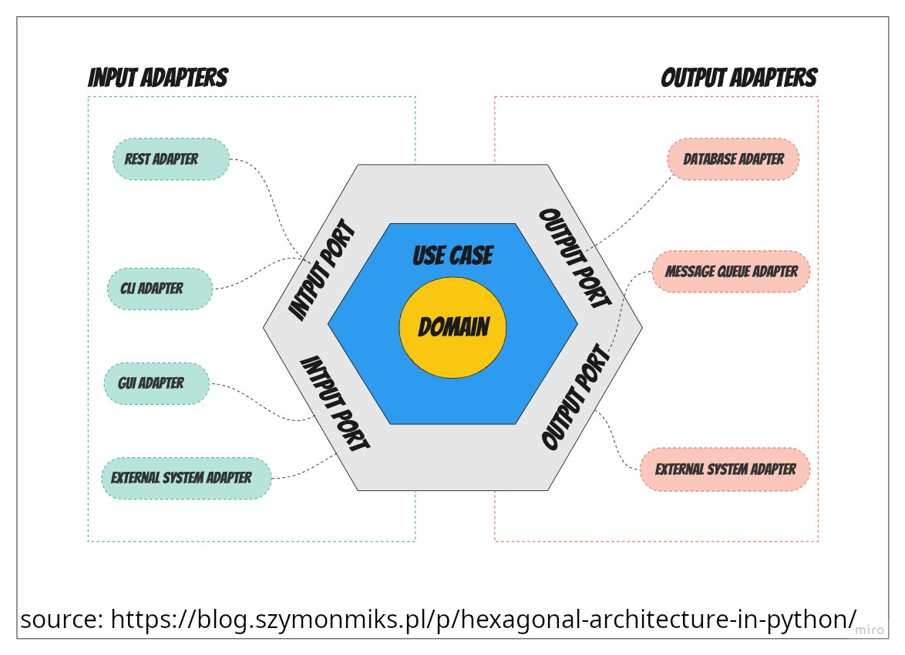


Donc, si vous avez bien suivi…


Mais, en vrai…


Et c'est ok !
```rust
fn process_data<F, B>(foo: F, bar: B) -> String
where
    F: Clone + Debug,
    B: Display + PartialEq,
{
    // Function implementation
    format!("{:?} - {}", foo, bar)
}
```


⬢ + 🦀 = 💓


Un écosystème de librairies applicatives solide, complet, et agréablement documenté


Il faut qu'on parle de `sqlx`


<!-- .slide: data-background-image="assets/sqlx-simple.png" data-background-size="contain" -->


<!-- .slide: data-background-image="assets/sqlx-complex.png" data-background-size="contain" -->


Les autres poids lourds : serde, tera, chrono, et bien d'autres !


Les Frameworks haut-niveau de Rust 🦀


Les vénérables axum et actix-web
Notes : Ont popularisé d'autres crates à travers elles, et cette autre façon de faire du Rust Applicatif


Axum

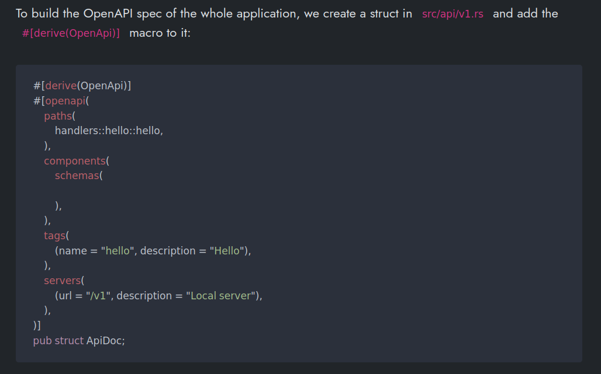
Notes : Mon premier, très simple (type Express), qui a bien évolué depuis


Actix-web


Notes : Les extracteurs Actix c'est une tuerie, et vous pouvez faire les votres (par ex, un extrateur de Cookie de Session)


Mais le monde des (c)rustacés va vite, très vite…


Dioxus, le framework isomorphique qui monte !

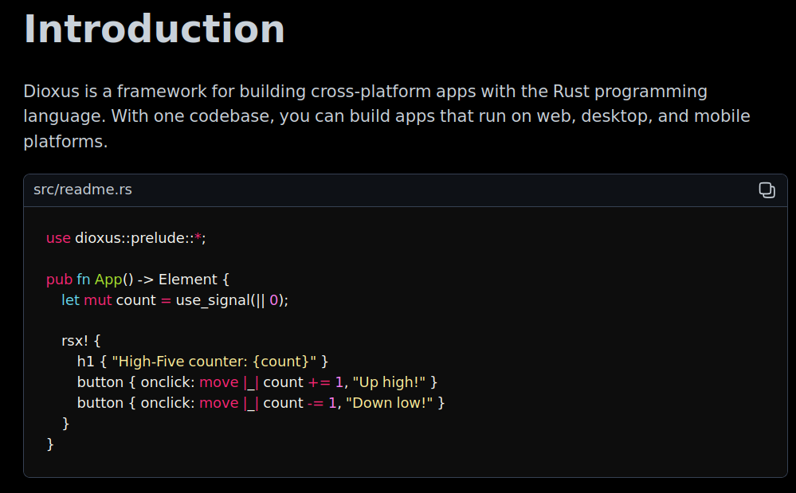


<!-- .slide: data-background-image="assets/dioxus-montage.png" data-background-size="contain" -->


Vous venez plutôt de Rails et RoR ? No problemo…


<!-- .slide: data-background-image="assets/loco-rs-montage.png" data-background-size="contain" -->


Une manière de tester les applications qui n'a pas son pareil


<!-- .slide: data-background-image="assets/cargo-test-colocalized.png" data-background-size="contain" -->


La doc des projets Rust est… \*chef kiss\* 🤌


<!-- .slide: data-background-image="assets/rust-doc-as-code.png" data-background-size="contain" -->
**TOUT EST « AS CODE »**
Notes : Plus vous mettez d'info dans le code, plus ça renvoie de la valeur.

Et les LLMs adoooorent ça


`cargo doc` , tout simplement

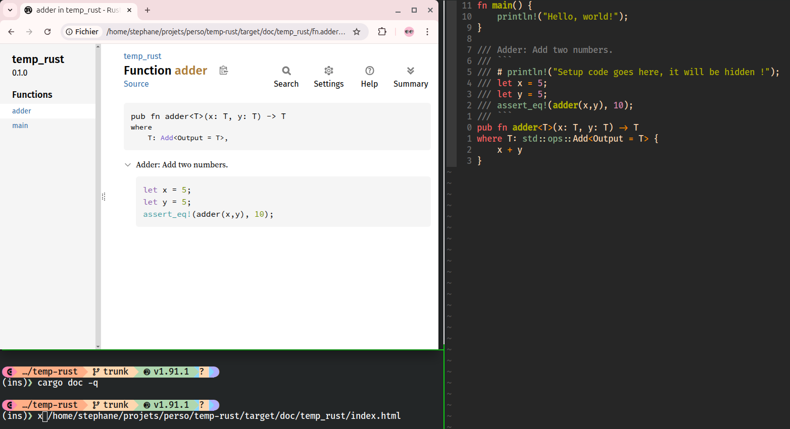


Oh, et ils sont *par défaut* testé par `cargo test` 😎

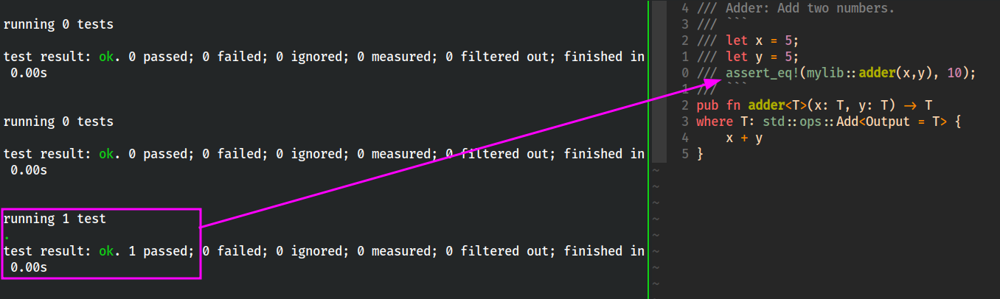


Votre doc contribue ne fait pas que décrire vos invariants,
elle les contrôle ! 💪

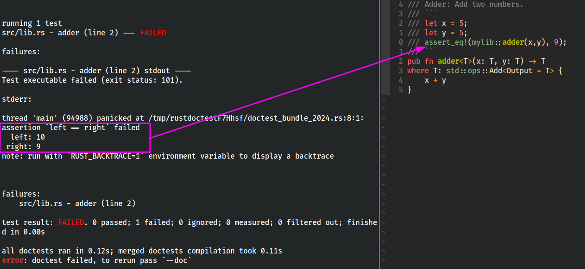


Tests d'Intégration ?

Facile ! On les met dans `/tests` (avec du code de setup si besoin)


D'ailleurs… Il faut qu'on parle de Wiremocks 🤩


Un cas difficile à tester : L'idempotence


<!-- .slide: data-background-image="assets/wiremock-idempotence.png" data-background-size="contain" -->


Si vous voulez aller plus loin...

(parce qu'il y en a encore plein, des dingueries comme ça 😅, dans Rust)
Notes : Property testing, optimisations diverses, hyperfine, et bien d'autres !


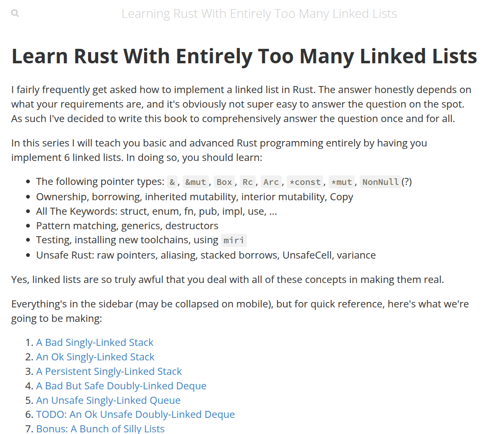


<!-- .slide: data-background-image="assets/lets-get-rusty.png" data-background-size="contain" -->
